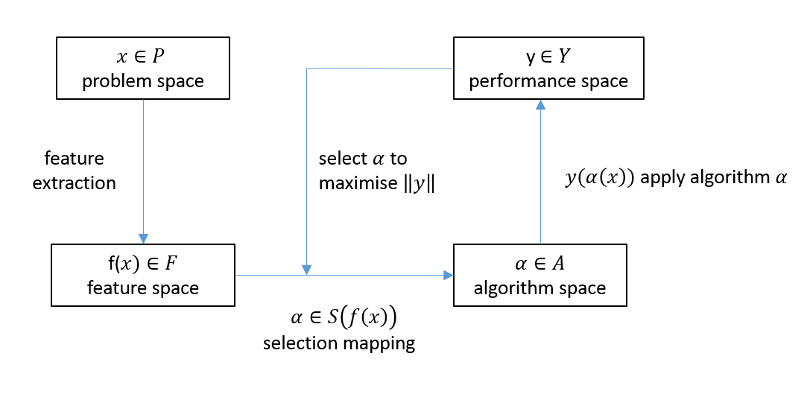

```{r initial, echo = FALSE, cache = FALSE, include = FALSE}
library(knitr)
opts_chunk$set(
  warning = FALSE,
  message = FALSE,
  echo = FALSE,
  fig.path = "figure/",
  cache.path = "cache/",
  fig.align = "center",
  fig.show = "hold",
  cache = TRUE,
  external = TRUE,
  dev = "pdf",
  fig.height = 5,
  fig.width = 8,
  out.width = "\\textwidth"
)
library(Mcomp)
library(ggplot2)
library(grid)
library(gridExtra)
library(ggrepel)
library(png)
library(tsfeatures)
library(tidyverse)
library(ggpubr)
# read_chunk('src/main.R')
```

\setlength{\abovedisplayskip}{5pt}
\setlength{\belowdisplayskip}{5pt}
\setlength{\abovedisplayshortskip}{0pt}
\setlength{\belowdisplayshortskip}{0pt}


# Introduction {#intro}

Forecasting is a key activity for any business to operate efficiently. The rapid advances in computing technologies have enabled businesses to keep track of large numbers of time series. Hence, it is becoming increasingly common to have to regularly forecast many millions of time series. For example, large scale businesses may be interested in forecasting sales, cost, and demand for their thousands of products across different locations, warehouses, etc. Technology companies such as Google collect many millions of daily time series such as web-click logs, web search counts, queries, revenues, number of users for different services, etc., and require fast and accurate automatic forecasts. However, the scale of these tasks have raised some computational challenges that we seek to address by proposing a new fast algorithm for model selection and time series forecasting.

When there is a large number of time series to forecast, there are at least three possible forecasting strategies: (1) a single method may be used to provide forecasts across all time series; (2) a framework can be developed to select the most appropriate forecasting method for each series; (3) several methods can be applied for each individual series and the resulting forecasts combined. It is very unlikely that a single method will consistently outperform its competitors across all time series, so we reject strategy 1. Because our focus is on fast, scalable forecasting, we also reject the combination approach (despite it often being the most accurate of the three strategies), as the computational requirements are much greater than for strategy 2. We adopt the approach of selecting an individual forecasting method for each time series to be forecast. 

However, selecting the most appropriate model for a given time series can also be problematic. Two of the most commonly used automatic algorithms are the automated Exponential Smoothing Algorithm (ETS) of @Hyndman2002 and the automated ARIMA algorithm of @Hyndman2008. Both algorithms are implemented in the forecast package in R [@forecast]. In this paradigm, a class of models is selected in advance, and many models within that class are estimated for each time series. The model with the smallest AICc value is chosen and used to compute forecasts. This approach relies on the expert judgement of the forecaster in first selecting the most appropriate class of models to use, as it is not usually possible to compare AICc values *between* model classes due to differences in the way the likelihood is computed, and the way initial conditions are handled.

An alternative approach, which avoids selecting a class of models *a priori*, is to use a simple "hold-out" test set; but then there is often insufficient data to draw a reliable conclusion. To overcome this problem, time series cross-validation can be used [@hyndman2014forecasting]; then models from many different classes may be applied, and the model with the lowest cross-validated MSE selected. However, this increases the computation involved considerably (at least to order $n^2$ where $n$ is the number of series to be forecast). 

Clearly, there is a need for a fast, accurate algorithm to automate forecast-model selection. We propose a general meta-learning framework using features of the time series to select the class of models, or even the specific model, to be used for forecasting.  The model selection process is carried out using a classification algorithm --- we use the time series features as inputs, and the best forecasting algorithm as the output. The classification algorithm can be built using a large historical collection of time series, in advance of the real forecasting exercise (so it is an "offline" procedure). Then, when we have a new time series to forecast, we can quickly compute its features, use the pre-trained classification algorithm to identify the best forecasting model, and produce the required forecasts. Thus, the "online" part of our algorithm requires only feature computation, and the application of a single forecasting model, with no need to estimate large numbers of models within a class, or to carry out a computationally-intensive cross-validation procedure.

The rest of this paper is organized as follows. We review the related work in \autoref{litreview}. In \autoref{methodology} we explain the detailed components and procedures of our proposed framework for forecast-model selection. In \autoref{Mcomp} we present the results, followed by the conclusions and future work in \autoref{discussion}.


# Literature Review {#litreview}

## Time series features

Rather than work with the time series directly at the level of individual observations, we propose analysing time series via an associated "feature space". A time series feature is any measurable characteristic of a time series. For example, \autoref{fig:fig1} shows the time-domain representation of six time series taken from the M3 competition [@makridakis2000m3] while \autoref{fig:fig2} shows a feature-based representation of the same time series. Here only two features are considered: the strength of seasonality and the strength of trend, calculated based on the measures introduced by @wang2009rule. Time series in the lower right quadrant of \autoref{fig:fig2} are non-seasonal but trended, while there is only one series with both high trend and high seasonality. We also see how the degree of seasonality and trend varies between series. Other examples of time series features include autocorrelation, spectral entropy and measures of self-similarity and non-linearity. @fulcher2014highly introduced 9000 operations to extract features from time series.  

```{r fig1, fig.cap="Time-domain representation of time series"}
# Extract required series
series_id <- c("N0001", "N0633", "N0625", "N0645","N1912", "N2012")
six_series <- lapply(M3[series_id], function(u){u$x})
p <- lapply(six_series,
  function(u) {autoplot(u) + xlab("") + ylab("")}
)
for (i in seq_along(six_series))
  p[[i]] <- p[[i]] + ggtitle(series_id[i])
grid.arrange(grobs = p, ncol = 3, nrow = 2)
```

```{r fig2, fig.cap="Feature-based representation of time series", out.width="70%"}
df <- tsfeatures(six_series, c("stl_features")) %>%
  select(trend, seasonal_strength) %>%
  rename(seasonality = seasonal_strength) %>%
  replace_na(list(seasonality = 0))
df$id <- names(six_series)
ggplot(df, aes(x = trend, y = seasonality)) +
  geom_point() +
  xlim(0, 1) + ylim(0, 1) +
  coord_fixed() +
  geom_text_repel(
    aes(label = id),
    colour = "black",
    size = 3,
    box.padding = unit(0.5, "lines")
  ) +
  theme(legend.position = "none")
```

The choice of the most appropriate set of features depends on both the nature of the time series being analysed, and the purpose of the analysis. In \autoref{Mcomp}, we study time series that have been used in the M1 and M3 competitions [@makridakis1982accuracy;@makridakis2000m3], and we select time series features for the purpose of forecast-model selection. Because the M1 and M3 competitions involve time series of different lengths, on different scales, and with different properties, we restrict our features to be ergodic, stationary and independent of scale. Because we are concerned with forecasting, we select features which have discriminatory power in selecting a good model for forecasting.

## What makes features useful for forecast-model selection?

@reid1972comparison pointed out that the performance of forecasting methods changes according to the nature of the data, and if the reasons for these variations are explored, they may be useful in selecting the most appropriate model. In response to the results of the M3 competition [@makridakis2000m3], similar ideas have been reported by others, who have argued that the characteristics of various time series may provide useful insights into which forecasting methods are most appropriate to forecast a given time series [@hyndman2001s;@lawrence2001s;@armstrong2001s].

Many time series forecasting techniques have been developed to capture specific characteristics of time series that are common in a particular discipline. For example, GARCH models were introduced to account for time-varying volatility in financial time series, and ETS models were introduced to handle the trend and seasonal patterns which are typical in quarterly and monthly sales data. An appropriate set of features should reveal the characteristics of the time series that are useful in determining the best forecasting method.

Several researchers have introduced rules for forecasting based on features [@collopy1992rule;@adya2001automatic;@wang2009rule]. @kang2017visualising applied principal component analysis to project a large collection of time series into a two dimensional feature space in order to visualize what makes a particular forecasting method perform well or not. The features they considered were spectral entropy, first-order auto-correlation coefficient, strength of trend, strength of seasonality, seasonal period and optimal Box-Cox transformation parameter. They also proposed a method for generating new time series based on specified features. 

## Meta-learning for algorithm selection

John Rice was an early and strong proponent of the idea of meta-learning, which he called the algorithm selection problem (ASP) [@rice1976]. The term *meta-learning* started to appear with the emergence of the machine-learning literature. Rice's framework for algorithm selection is shown in \autoref{fig:rice}.

```{r rice, fig.cap="Rice's framework for the Algorithm Selection Problem (reproduced from Smith-Miles, 2009)", out.width="80%"}

```

There are four main components in Rice's framework. The problem space, $P$, represents the data sets used in the study. The feature space, $F$, is the range of measures that characterize the problem space $P$. The algorithm space, $A$, is a list of suitable candidate algorithms which we can use to find solutions to the problems in $P$. The performance metric, $Y$, is a measure of algorithm performance such as accuracy, speed, etc. Rice's formal definition of the algorithm selection problem is [@smith2009cross] as follows.

\begin{definition}
\label{def2}
For a given problem instance $x \in P$, with features $f(x) \in F$, find the selection mapping $S(f(x))$ into algorithm space $A$, such that the selected algorithm $\alpha \in A$ maximizes the performance mapping $y(\alpha(x)) \in Y$.
\end{definition}

The main challenge in ASP is to identify the selection mapping $S$ from the feature space to the algorithm space. Even though Rice's framework articulates a conceptually rich framework, it does not specify how to obtain $S$. This gives rise to the meta-learning approach. 

The meta-learning framework consists of an offline (training) phase and an online (prediction) phase. In the offline phase, the mapping $S$ is learned based on a collection of training examples. This is performed using a *meta-learner* which can be any supervised learning algorithm designed to estimate $S$. The inputs for the meta-learner are known as *meta-features*, and instances in the algorithm space are the *output labels*. The database comprising both input-features and output-labels is called *meta-data*. In the online phase of the algorithm, input-features are extracted from new data and passed into the meta-learner that was constructed in the offline phase, in order to predict the output-labels of the new data.

## Forecast-model selection using meta-learning

Selecting models for forecasting can be framed according to Rice's ASP framework.

\begin{definition}
\label{def2}
For a given time series $x \in P$, with features $f(x) \in F$, find the selection mapping $S(f(x))$ into the algorithm space $A$, such that the selected algorithm $\alpha \in A$ minimizes forecast accuracy error metric $y(\alpha(x)) \in Y$ on the test set of the time series.
\end{definition}

Existing methods differ with respect to the way they define the problem space ($A$), the features ($F$), the forecasting accuracy measure ($Y$) and the selection mapping ($S$).

@collopy1992rule introduced 99 rules based on 18 features of time series, in order to make forecasts for economic and demographic time series. This work was extended by @armstrong2001s to reduce human intervention.  @shah1997model used the following features to classify time series: the number of observations, the ratio of the number of turning points to the length of the series, the ratio of number of step changes, skewness, kurtosis, the coefficient of variation, autocorrelations at lags 1--4, and partial autocorrelations at lag 2--4. Casting Shah's work in Rice's framework, we can specify: $P=203$ quarterly series from the M1 competition [@makridakis1982accuracy]; $A=3$ forecast-models, namely simple exponential smoothing, Holt-Winters exponential smoothing with multiplicative seasonality, and a basic structural time series model; $Y=$ mean squared error for a hold-out sample. The mapping $S$ is learned using discriminant analysis. 

@prudencio2004meta was the first paper to use the term "meta-learning" in the context of time series model selection. They studied the applicability of meta-learning approaches for forecast-model selection based on two case studies. Again using the notation of Definition \ref{def2}, we can describe their first case study with: $A$ contained only two forecast-models, simple exponential smoothing and a time-delay neural network; $Y=$ mean absolute error; $F$ consisted of 14 features, namely length, autocorrelation coefficients, coefficient of variation, skewness, kurtosis, and a test of turning points to measure the randomness of the time series;  $S$ was learnt using the C4.5 decision tree algorithm. For their second study, the algorithm space included a random walk, Holt's linear exponential smoothing and AR models; the problem space $P$ contained the yearly series from the M3 competition [@makridakis2000m3]; $F$ included a subset of features from the first study; and $Y$ was a ranking based on error. Beyond the task of forecast-model selection, they used the NOEMON approach to rank the algorithms [@kalousis1999noemon].

@lemke2010meta studied the applicability of different meta-learning approaches for forecast-model selection. Their algorithm space $A$ contained ARIMA models, exponential smoothing models and a neural network model. In addition to statistical measures such as the standard deviation of the detrended series, skewness, kurtosis, length, strength of trend, Durbin-Watson statistics of regression residuals, the number of turning points, step changes, a predictability measure, nonlinearity, the largest Lyapunov exponent, and auto-correlation and partial-autocorrelation coefficients, he also used frequency domain based features. The feed forward neural network, decision tree and support vector machine approaches were considered to learn the mapping $S$.

@wang2009rule used a meta-learning framework to provide recommendations as to which forecast method to use to generate forecasts. In order to evaluate forecast accuracy, they introduced a new measure $Y =$ *simple percentage better (SPB)*, which calculates the forecasting accuracy of a method against the forecasting accuracy error of random walk model. They used a feature set $F$ comprising nine features: strength of trend, strength of seasonality, serial correlation, nonlinearity, skewness, kurtosis, self-similarity, chaos and periodicity. The algorithm space $A$ included eight forecast-models, namely, exponential smoothing, ARIMA, neural networks and random walk model; while the mapping $S$ was learned using the C4.5 algorithm for building decision trees. In addition, they used SOM clustering on the features of the time series in order to understand the nature of time series in a two-dimensional setting. 

The set of features introduced by @wang2009rule was later used by @widodomodel to develop a meta-learning framework for forecast-model selection. The authors further reduced the dimensionality of time series by performing principal component analysis on the features. 

More recently, @kuck2016meta proposed a meta-learning framework based on neural networks for forecast-model selection. Here, $P = 78$ time series from the NN3 competition were used to build the meta-learner. They introduced a new set of features based on forecasting errors. The average symmetric mean absolute percentage error was used to identify the best forecast-models for each series. They classify their forecast-models in the algorithm space $A$, comprising single, seasonal, seasonal-trend and trend exponential smoothing. The mapping $S$ was learned  using a feed-forward neural network. Further, they evaluated the performance of different sets of features for forecast-model selection.

# Methodology {#methodology}

Our proposed framework is presented in \autoref{fig:framework}. The offline and online parts of the framework are shown in blue and red respectively. A classification algorithm (the meta-learner) is trained during the offline phase and then is used to select appropriate forecast-models for new time series in the online phase. 


```{r framework, fig.cap="Proposed framework (blue: offline phase, red: online phase)"}
knitr::include_graphics("figures/framework.png")
```

\begin{algorithm}[!hb]
  \caption{Identification of the "best" forecast method for a new time series.}
  \label{alg:algo-lab}
  \begin{algorithmic}[1]
    \Statex \textbf{Offline phase}
    \Statex \text{Given:}
    \Statex \hspace{1cm}$O=\{t_1, t_2, \dots,t_n\}:$ the collection of $n$ observed time series.
      \Statex \hspace{1cm}$L:$ the set of class labels (e.g.\ ARIMA, ETS, SNAIVE).
         \Statex \hspace{1cm}$F:$ the set of functions to calculate time series features.
         \Statex \hspace{1cm}$nsim:$ number of series to be simulated.
         \Statex \hspace{1cm}$B:$ number of trees in the random forest.
         \Statex \hspace{1cm}$mtry:$ number of features to be selected at each node.
     \Statex \text{Output:}
      \Statex \hspace{1cm}\text{a random forest classifier} 
      \Statex
     \Statex \textit{Prepare the reference set}
    \Statex For $i=1$ to $n$:
            \State Fit ARIMA and ETS models to $t_i$.
            \State Simulate $nsim$ time series from each model in step 1.
            \State The time series in $O$ and simulated time series in step 2 form the reference set $R=\{t_1, t_2, \dots,t_n, t_{n+1},\dots,t_N\}$ where $N = n + nsim$.
    \Statex 
    \Statex \textit{Prepare the meta-data}
    \Statex For $j=1$ to $N$:
            \State Split $t_j$ into a training period and test period.
            \State Calculate features $F$ based on the training period. 
            \State Fit $L$ models to the training period.
            \State Calculate forecasts for the test period from each model.
            \State Calculate forecast error measure over the test period for all models in $L$.
            \State Select the model with the minimum forecast error.
            \State Meta-data: input features (step 5), output labels (step 9).
     \Statex
    \Statex \textit{Train a random forest classifier}
            \State Train a random forest classifier based on the meta-data.
            \State {Random forest: the ensemble of trees $\{T_b\}_1^B$}. 
    \Statex
     \Statex \textbf{Online phase}
    \Statex \text{Given:}
    \Statex \hspace{1cm}\text{the random forest classifier from step 12} .
     \Statex \text{Output:}
      \Statex \hspace{1cm}\text{class labels for newly arrived time series $t_{new}$}.
  \State For $t_{new}$ calculate features $F$.
  \State Let $\hat{C_b}(t_{new})$ be the class prediction of the $b^{th}$ random forest tree. Then class label for $t_{new}$ is $\hat{C_{rf}}(t_{new})=majorityvote\{\hat{C_b}(t_{new})\}_1^B$.
   \end{algorithmic}
\end{algorithm}


In order to train our classification algorithm, we need a large collection of time series which are similar to those we will be forecasting. We assume that we have an essentially infinite population of time series, and we take a sample of them in order to train the classification algorithm. The new time series we wish to forecast can be thought of as additional draws from the same population.  Hence, any conclusions made from the classification framework refer only to the population from which the sample has been selected. We may call this the "target population" of time series. It is important to have a well-defined target population to avoid misapplying the classification rules. We denote the collection of time series used for training the classifier as the "reference set". We split each time series within the reference set into a training period and a test period. From each training period we compute a range of time series features, and fit a selection of potential models. The calculated features form the input vector to the classification algorithm. Using the fitted models, we generate forecasts and identify the "best" model for each time series based on a forecast error measure (e.g., MASE) calculated over the test period. The models deemed "best" form the output labels for the classification algorithm. The pseudo code for this algorithm is given in Algorithm \autoref{alg:algo-lab}. In the following sections, we briefly discuss aspects of the offline part of the algorithm.

## Augmenting the observed sample with simulated series

In practice, we may wish to augment our set of training time series by simulating new time series that are similar to those from the population. This process may be useful when our observed sample of time series is too small to build a reliable classifier. Alternatively, we may wish to add more of some types of time series to the reference set in order to get a more balanced sample for the classification. In order to produce simulated series that are similar to our population, we consider two classes of data generating processes: Exponential Smoothing Models and ARIMA models using automated algorithms such as `ets` and `auto.arima` [@forecast]. We identify models, based on model selection criteria (such as AICc) and simulate multiple time series from the selected models within each model class. Assuming the models produce data that are similar to the observed time series, this ensures that the simulated series are similar to those in the population. Note that this is done in the offline phase of the algorithm, so the computational time in producing these simulated series is of no real consequence.

## Input: features

Our proposed algorithm requires features that enable identification of a suitable forecast-model for a given time series. Therefore, the features used should capture the dynamic structure of the time series, such as autocorrelation, trend, seasonality, nonlinearity, heterogeneity, and so on.

The purpose of this feature-based framework is to reduce the time required for model selection.  Therefore, time needed to calculate the input features should be significantly less than the time required to estimate the parameters of all candidate models in a model selection procedure. Furthermore, interpretability, robustness to outliers, scale and length independence need to be considered when selecting features for this classification problem. A comprehensive description of the features used in the experiment is specified in \autoref{feature}.

## Output: labels

The task of our classification framework is to identify the best forecasting method for a given time series. We define the best forecast-model as the model with the lowest forecast accuracy measure (e.g., MAPE or MASE) over the test period.

It is not possible to train all possible classes of time series models, but at least we should consider enough possibilities so that the algorithm can be used for model selection with high confidence. The models to be considered will depend on the specific population of time series we need to forecast. For example, if we have only non-seasonal time series, and no chaotic features, we may wish to restrict our models to random walks, white noise, ARIMA processes and ETS processes. Even in this scenario, the number of possible models can be quite large. In order to identify the best forecast-model for each series, all the models considered are run on all time series in the reference set, and forecasts are generated from each of them. Model estimation is strictly done on the training period of each series and forecasts are compared with the values in the test period. This step is computationally intensive and time-consuming, as all models have to be applied on each series in the reference set.  However, since this is done only in the offline phase, the time involved and the computational cost associated with this task is of no significant cost.

## Random forest algorithm

A random forest [@breiman2001random] is an ensemble learning method that combines a large number of decision trees using a two-step randomization process. Let $Z=\{(\bm{x}_1, y_1), (\bm{x}_2, y_2), \dots, (\bm{x}_N, y_N)\}$ be the reference set, where the input $\bm{x}_i$ is an $m$-vector of features, the output, $y_i$, corresponds to the class label of the $i$th observation, $m$ is the total number of features, and $N$ is the number of training samples in the reference set. Each tree in the forest is grown based on a bootstrap sample of size $N$ from the reference set. At each node of the tree, randomly select $f<m$ features from the full set of features. The best split is selected among those $f$ features. The split which results in the most homogeneous subnodes is considered the best split. Various measures have been introduced to evaluate the homogeneity of subnodes, such as classification error rate, the Gini index and cross entropy [@friedman2001elements]. In this study, we use the Gini index to evaluate the homogeneity of a particular split. The trees are grown to the largest extent possible without pruning. To determine the class label for a new instance, features are calculated and passed down the trees. Then each tree gives a prediction and the majority vote over all individual trees leads to the final decision. In this work, we have used the randomForest package [@liaw2002randomforest; ; @rfpkg] in R [@Rcore] which implements the Fortran code for Random Forest classification by @breiman2004random.

# Application to M competition Data {#Mcomp}

To test how well our proposed framework can identify suitable forecast-models, we use the time series of the M1 competition [@makridakis1982accuracy] and M3 competition [@makridakis2000m3]. The R package Mcomp [@hyndmanmcomp] provides the data from both competitions. The proposed algorithm is applied to yearly, quarterly and monthly series separately.  We run two experiments for each case. In the first experiment, we treat the time series of the M1 competition as the *observed sample* and the time series of the M3 competition as the collection of *new time series*. We reverse the sets in the second experiment, using the M3 data as the *observed sample* and the M1 data as the *new time series*. This allow us to compare our results with published forecast accuracy results for each competition. In both experiments, we fit ARIMA and ETS models to the full length of each series in the corresponding *observed samples* using the `auto.arima` and `ets` functions in the forecast package [@forecast]. From each model fitted to annual and quarterly data, we simulate a further 1000 series. For monthly time series, we simulate a further 100 series (to speed up the offline calculation process). The lengths of the simulated time series are set to be equal to the lengths of the series on which they were based.

As shown in \autoref{fig:framework}, the task of constructing the meta-database contains two main components: (i) identification of an *output-label* and (ii) computation of features. 

The output-labels we consider in this experiment are:

  \begin{compactenum}[\hspace*{1cm}(a)]
  \item White noise process (WN);
  \item AR/ MA/ ARMA;
  \item ARIMA;
  \item Random walk with drift (RWD);
  \item Random walk (RW);
  \item Theta;
  \item STL-AR;
  \item Exponential Smoothing Model (ETS) without trend and seasonal components;
  \item ETS with trend component and without seasonal component;
  \item ETS with damped trend component and without seasonal component;
  \end{compactenum}

Most of these are self-explanatory labels based on models implemented in the forecast package [@forecast]. STL-AR refers to a model based on an STL decomposition method applied to the time series, then an AR model is used to forecast the seasonally adjusted data, while the seasonal naive method is used to forecast the seasonal component.

In addition to the above ten output labels, we further include the following five class labels for seasonal data:

  \begin{compactenum}[\hspace*{1cm}(a)]\setcounter{enumi}{10}
  \item ETS with trend and seasonal components
  \item ETS with damped trend and seasonal components
  \item ETS with seasonal components and without trend component
  \item SARIMA
  \item Seasonal naive method.
  \end{compactenum}

The models are estimated using the training period for each series, and forecasts are produced for the whole of the test periods. We further use the `auto.arima` and `ets` functions in the forecast package to identify suitable AR/MA/ARMA, ARIMA, SARIMA and ETS models. The model corresponding to the smallest MASE [@hyndman2006another] for the test period is selected as the *output-label*. 
 

## Feature computation process {#sec:features}

We use a set of 25 features for yearly data and a set of 30 features for seasonal data. Some of these are taken from previous studies [@wang2009rule; @hyndman2015large; @kang2017visualising], and we have added some new features that we believe provide some useful information. Each feature can be computed rapidly, thus making the online phase of our algorithm very fast. The features are summarized in \autoref{feature}, and fully described in the Appendix.

\begin{table}[!htp]
\centering\footnotesize\tabcolsep=0.12cm
\def\yes{$\checkmark$}
\caption{Features used for selecting a forecast-model.}
\label{feature}
\begin{tabular}{llp{8,8cm}cc}
\toprule
\multicolumn{2}{c}{Feature} & Description & Non-seasonal & Seasonal\\ 
\midrule
1  & T              & length of time series                                                                   & \yes  & \yes \\
2  & trend          & strength of trend                                                                       & \yes  & \yes\\
3  & seasonality       & strength of seasonality                                                                 & -     & \yes \\
4  & linearity      & linearity                                                                               & \yes  & \yes \\
5  & curvature      & curvature                                                                               & \yes  & \yes \\
6  & spikiness      & spikiness                                                                               & \yes  & \yes \\
7  & e\_acf1        & first ACF value of remainder series                                                     & \yes  & \yes \\
8  & stability      & stability                                                                               & \yes  & \yes \\
9  & lumpiness      & lumpiness                                                                               & \yes  & \yes \\
10 & entropy        & spectral entropy                                                                        & \yes  & \yes \\
11 & hurst          & Hurst exponent                                                                          & \yes  & \yes \\
12 & nonlinearity   & nonlinearity                                                                            & \yes\ & \yes \\
13 & alpha          & ETS(A,A,N) $\hat\alpha$                                                                 & \yes  & \yes \\
14 & beta           & ETS(A,A,N) $\hat\beta$                                                                  & \yes  & \yes\\
15 & hwalpha        & ETS(A,A,A) $\hat\alpha$                                                                 & -     & \yes \\
16 & hwbeta         & ETS(A,A,A) $\hat\beta$                                                                  & -     & \yes \\
17 & hwgamma        & ETS(A,A,A) $\hat\gamma$                                                                 & -     & \yes \\
18 & ur\_pp         & test statistic based on Phillips-Perron test                                            & \yes  & - \\
19 & ur\_kpss       & test statistic based on KPSS test                                                       & \yes  & - \\
20 & y\_acf1        & first ACF value of the original series                                                  & \yes  & \yes \\
21 & diff1y\_acf1   & first ACF value of the differenced series                                               & \yes  & \yes \\
22 & diff2y\_acf1   & first ACF value of the twice-differenced series                                         & \yes  & \yes \\
23 & y\_acf5        & sum of squares of first 5 ACF values of original series                                 & \yes  & \yes \\
24 & diff1y\_acf5   & sum of squares of first 5 ACF values of differenced series                              & \yes  & \yes \\
25 & diff2y\_acf5   & sum of squares of first 5 ACF values of twice-differenced series                        & \yes  & \yes \\
26 & seas\_acf1     & autocorrelation coefficient at first seasonal lag                                                & -     & \yes \\
27 & sediff\_acf1   & first ACF value of seasonally-differenced series                                        & -     & \yes\\
28 & sediff\_seacf1 & ACF value at the first seasonal lag of seasonally-differenced series                    & -     & \yes \\
29 & sediff\_acf5   & sum of squares of first 5 autocorrelation coefficients of seasonally-differenced series & -     & \yes \\
30 & lmres\_acf1    & first ACF value of residual series of linear trend model                                & \yes  & - \\
31 & y\_pacf5       & sum of squares of first 5 PACF values of original series                                & \yes  & \yes \\
32 & diff1y\_pacf5  & sum of squares of first 5 PACF values of differenced series                             & \yes  & \yes \\
33 & diff2y\_pacf5  & sum of squares of first 5 PACF values of twice-differenced series                       & \yes  & \yes \\
\bottomrule
 \end{tabular}
\end{table}


The correlation matrices for all features are presented in \autoref{fig:cormat}. The variability in the correlations reflects the diversity of the selected features. In other words, the features we used were able to capture different characteristics of the time series. Further, the structure of the correlation matrices are similar to each other, showing the different collections have similar feature spaces.


```{r cormat,  fig.width=7,fig.height=9, fig.cap=" Correlation matrix plots for the reference sets. A: Experiment 1 yearly, B: Experiment 2 yearly, C: Experiment 1 quarterly, D: Experiment 2 quarterly, E: Experiment 1 monthly, F: Experiment 2 monthly."}
# the relevant codes are available at: https://github.com/thiyangt/WorkingPaper1/blob/master/src/main.R

img1 <- rasterGrob(
  as.raster(readPNG("figures/ggheatmapA.png")),
  interpolate = FALSE
)
img2 <- rasterGrob(
  as.raster(readPNG("figures/ggheatmapB.png")),
  interpolate = FALSE
)
img3 <- rasterGrob(
  as.raster(readPNG("figures/ggheatmapC.png")),
  interpolate = FALSE
)
img4 <- rasterGrob(
  as.raster(readPNG("figures/ggheatmapD.png")),
  interpolate = FALSE
)
img5 <- rasterGrob(
  as.raster(readPNG("figures/ggheatmapE.png")),
  interpolate = FALSE
)
img6 <- rasterGrob(
  as.raster(readPNG("figures/ggheatmapF.png")),
  interpolate = FALSE
)
grid.arrange(img1, img2, img3, img4, img5, img6, ncol = 2)
```

## Model calibration

The random forest algorithm is highly sensitive to class imbalance [@breiman2001random], and our reference set is unbalanced: some classes contain significantly more cases than other classes. The degree of class imbalance is reduced to some extent by augmenting the observed sample with the simulated time series.  We consider three approaches to address the class imbalance in the data: 1) we incorporate class priors into the random forest classifier; 2) we use the Balanced Random Forest (BRF) algorithm introduced by @chen2004using; and 3) we re-balance the reference set with down-sampling. In down-sampling, the size of the reference set is reduced by down-sampling the larger classes so that they match the smallest class in size; this potentially discards some useful information. We compare the results of these three approaches to the classifier built on unbalanced data. The BRF and RF with down-sampling did not yield
satisfactory results. Therefore, we reported only the results obtained by RF bulilt on unbalanced data and RF with class priors. The RF algorithms are implemented by the randomForest R package [@liaw2002randomforest; @rfpkg]. The class priors are introduced through the option `classwt`. We use the reciprocal of class size as the class priors. The number of trees `ntree` is set to 1000, and the number of randomly selected features `mtry` is set to be one third of the total number of features available. 

Our aim is different from most classification problems in that we are not interested in accurately predicting the class, but in finding a good forecast-model. It is possible that two models produce almost equally good forecasts, and then it does not matter whether the classifier picks one or the other. Consequently, we do not study the classification accuracy of our random forests, but only report the forecast accuracy obtained with using them.


## Summary of the main results {#sec:results}

We build separate random forest classifiers for yearly data, quarterly data and monthly data. For the second experiment, in the case of yearly and quarterly data we take a subset of the simulated time series when training the RF-unbalanced and RF-class priors, to reduce the size of the reference set. The subsets are selected randomly according to the proportions of output-labels in the observed samples. This ensures that our reference set shares similar characteristics to the observed sample. 

Principal component analysis is used to visualize the feature-spaces of the different time series collections. We compute the principal components projection using the features in the observed sample, and then project the simulated time series and the new time series using the same projection. The results are shown in Figures \ref{fig:exp1}--\ref{fig:exp2}, where the first three principal components are plotted against each other. Figure \ref{fig:exp1} refer to Experiment 1 (for which M1 is the observed times series and M3 is the new times series) and the Figure \ref{fig:exp2} to Experiment 2 (for which M3 is the observed time series and M1 is the new time series). The points on each plot represent individual time series. On each figure the top three rows refer to the yearly data, the middle three to the quarterly data and the bottom three to the monthly data. The first three principle components explain 62.5\%, 62.4\% and 58.93\% of the total variation in the yearly, quarterly and monthly M1 data and 62.2\% 64.75\% and 65.97\%  of the total variation in the yearly, quarterly and monthly M3 data.

The plots show that the distribution of the observed times series over the PCA space (represented by the black dots) is very similar to that of the new time series (represented by the orange dots). More importantly, we see that the distribution of the simulated time series (represented by the green dots and yellow dots - the yellow dots are a subset of the simulated series) clearly nests that and fills in the space of the new time series. Further, in both experiments, all the *observed time series* fall within the space of all simulated data. This strongly indicates that we have not reduced the feature diversity from the observed sample. This shows that our approach of augmenting the observed time series with simulated is successful. By augmenting the reference set with simulated time series, we were able to increase the diversity and evenness of the feature space of the observed time series. 


The accuracy of our method is compared against the following commonly-used forecasting methods:

  1. automated ARIMA algorithm of @Hyndman2008;
  2. automated ETS algorithm of @Hyndman2008;
  3. Random walk with drift (RWD);
  4. Random walk model (RW);
  5. White noise process (WN);
  6. Theta method;
  7. STL-AR method;
  8. seasonal naive (for seasonal data).

The automated ARIMA and ETS algorithms are implemented using the `auto.arima` and `ets` functions available in the forecast package in R [@forecast]. Each method is implemented on the training period and forecasts are computed up to the full length of the test period. Then we compute the MASE for each forecast horizon, by averaging the MASE across all series in the collection of new time series. To assist in the evaluation of the proposed framework, for each forecast horizon we rank our method compared to the other methods listed above, and an average ranking over all forecast horizons is computed. The results are given in Table \ref{masetab}. The MASE value corresponding to the best performing method in each category is highlighted in bold.


```{r exp1, fig.cap="Experiment 1: Distribution of time series in the PCA space. Distribution of yearly series are shown in panels 1A-- 1C, distribution of quarterly series are shown in panels 2A--2C, and the distribution of monthly series are shown in panels 3A--3C. On each graph, green indicates simulated time series, black indicates observed time series, while orange denotes new time series."}
# the relevant codes are available at: https://github.com/thiyangt/WorkingPaper1/blob/master/src/main.R
img1 <- rasterGrob(as.raster(readPNG("figures/pca1M1Y.png")),interpolate = FALSE)
img2 <- rasterGrob(as.raster(readPNG("figures/pca2M1Y.png")),interpolate = FALSE)
img3 <- rasterGrob(as.raster(readPNG("figures/pca3M1Y.png")),interpolate = FALSE)
img4 <- rasterGrob(as.raster(readPNG("figures/pca1M1Q.png")),interpolate = FALSE)
img5 <- rasterGrob(as.raster(readPNG("figures/pca2M1Q.png")),interpolate = FALSE)
img6 <- rasterGrob(as.raster(readPNG("figures/pca3M1Q.png")),interpolate = FALSE)
img7 <- rasterGrob(as.raster(readPNG("figures/pca1M1M.png")), interpolate = FALSE)
img8 <- rasterGrob(as.raster(readPNG("figures/pca2M1M.png")), interpolate = FALSE)
img9 <- rasterGrob(as.raster(readPNG("figures/pca3M1M.png")), interpolate = FALSE)
grid.arrange(img1, img2, img3, img4, img5, img6, img7, img8, img9, ncol = 3)
```


```{r exp2, fig.cap="Experiment 2: Distribution of time series in the PCA space. Distribution of yearly series are shown in panels 1A-- 1C, distribution of quarterly series are shown in panels 2A--2C, and the distribution of monthly series are shown in panels 3A--3C. On each graph, green indicates simulated time series, yellow shows a subset of simulated time series, black indicates observed time series, while orange denotes new time series."}
# the relevant codes are available at: https://github.com/thiyangt/WorkingPaper1/blob/master/src/main.R

img1 <- rasterGrob(as.raster(readPNG("figures/pca1M3Y.png")),interpolate = FALSE)
img2 <- rasterGrob(as.raster(readPNG("figures/pca2M3Y.png")),interpolate = FALSE)
img3 <- rasterGrob(as.raster(readPNG("figures/pca3M3Y.png")),interpolate = FALSE)
img4 <- rasterGrob(as.raster(readPNG("figures/pca1M3Q.png")),interpolate = FALSE)
img5 <- rasterGrob(as.raster(readPNG("figures/pca2M3Q.png")),interpolate = FALSE)
img6 <- rasterGrob(as.raster(readPNG("figures/pca3M3Q.png")),interpolate = FALSE)
img7 <- rasterGrob(as.raster(readPNG("figures/pca1M3M.png")), interpolate = FALSE)
img8 <- rasterGrob(as.raster(readPNG("figures/pca2M3M.png")), interpolate = FALSE)
img9 <- rasterGrob(as.raster(readPNG("figures/pca3M3M.png")), interpolate = FALSE)

grid.arrange(img1, img2, img3, img4, img5, img6, img7, img8, img9, ncol = 3)
```

\begin{table}[!htbp]
\centering\tiny
\centering
\caption{Out-of-sample forecast performances from experiment 1 and experiment 2}
\label{masetab}
\begin{tabular}{lrrrrrrcrrrrrrc}
\hline
 & \multicolumn{7}{c}{Experiment 1: training-M1, test-M3} & \multicolumn{7}{c}{Experiment 2: training-M3, test-M1} \\ \cmidrule(lr){2-8} \cmidrule(lr){9-15}
 & \multicolumn{7}{c}{Yearly: 645 M3 time series} & \multicolumn{7}{c}{Yearly: 181 M1 time series} \\ 
 & h=1  & 1-2  &  1-3 & 1-4 & 1-5 & 1-6 & avg. Rank &  h=1 & 1-2  &  1-3 & 1-4 & 1-5 & 1-6 & avg. Rank\\ \cmidrule(lr){2-8} \cmidrule(lr){9-15}
RF-unbalanced &  1.06 & 1.42  & 1.83  & 2.20 &  2.54&2.85  &  3.50& \bf{0.97}  & \bf{1.39}  & 1.93  &2.42  &  2.90& 3.37 &1.67  \\ 
RF-class priors & \bf{1.03}  & 1.37  &  1.78 &  2.14& 2.47 &  2.77&  1.83&  1.02 &  1.40 &  \bf{1.92} & \bf{2.40} & \bf{2.87} & \bf{3.33} & 1.33 \\ 
auto.arima &  1.11 &  1.48 &  1.90 &  2.28& 2.63 &2.96  & 6.83 &  1.06 &  1.47 &  2.01 &  2.51&3.00  &3.47  & 3.50 \\ 
ets & 1.09  & 1.44  & 1.84  & 2.20 &  2.54& 2.86 &  4.17& 1.12  & 1.59
&2.17   &2.72  &3.26  & 3.77 &  6.00\\ 
WN &  6.54 &  6.91 &  7.22 &  7.48& 7.76 &8.07  &9.00  &  6.38 &  7.08 &  7.92 &8.59  &9.28  &  10.01&  9.00\\ 
RW & 1.24  &  1.68 &  2.11 &  2.48& 2.83 &  3.17&8.00  &  1.35 &  2.00 &  2.80 &  3.50& 4.19 &  4.89& 8.00 \\ 
RWD & \bf{1.03}  &  \bf{1.36} & \bf{1.74}  &  \bf{2.05}&  \bf{2.35}&  \bf{2.63}&1.17  & 1.03  &  1.44 & 2.00  & 2.51 &  3.01& 3.49 &  3.33\\ 
STL-AR & 1.09  &  1.47 &  1.89 &  2.27& 2.62 &  2.95& 5.50 & 1.10  &  1.51 &  2.07 &  2.55& 3.04 & 3.52 & 5.00 \\ 
Theta & 1.12  & 1.47  & 1.86  & 2.18 &  2.48&  2.77&  4.17& 1.15  & 1.70  & 2.38  & 3.00 &  3.59& 4.19 &  7.00\\ \cmidrule(lr){2-8} \cmidrule(lr){9-15}
 & \multicolumn{7}{c}{Quarterly: 756 M3 time series} & \multicolumn{7}{c}{Quarterly: 203 M1 time series} \\ 
  & h=1  & 1-4  &  1-5 & 1-6 & 1-7 & 1-8 & avg. Rank &  h=1 & 1-4  &  1-5 & 1-6 & 1-7 & 1-8 & avg. Rank\\ \cmidrule(lr){2-8} \cmidrule(lr){9-15}
RF-unbalanced  &  0.58 &  \bf{0.81} & \bf{0.88}  &  \bf{0.96}&\bf{1.04}  &1.12  &  1.33 & \bf{0.77}  & \bf{1.08}  & \bf{1.22}  &  \bf{1.36}&  \bf{1.48}&\bf{1.59}  &  1.00\\ 
RF-class priors & 0.58  & 0.81  & 0.89  & 0.97 &  1.05&1.13  & 2.17 &  0.79 & 1.12  & 1.28& 1.41 & 1.53 & 1.65  & 2.33 \\ 
auto.arima & 0.58  & 0.85  &  0.93 & 1.01 & 1.10 & 1.19 & 4.50 &  0.85 &  1.19 & 1.37  & 1.53 &  1.67 & 1.80 & 5.00 \\ 
ets & \bf{0.56}  &  0.82 &  0.91 &  0.99& 1.08 &  1.17& 3.33 & 0.78  &  1.11 &  1.28 &  1.42& 1.54 &  1.66& 2.50 \\ 
WN  & 3.25  & 3.59  & 3.63  & 3.70 &  3.78& 3.87 &10.00  &  3.97 &  4.27 &  4.35 &  4.45& 4.52 &4.64  &  10.00\\ 
RW  & 1.14  & 1.16  & 1.25  & 1.32 &  1.41& 1.46 &7.17  &0.97   & 1.35  & 1.52  & 1.67 &  1.83& 1.95 & 7.17 \\ 
RWD & 1.20  & 1.17  &1.29   & 1.36 &  1.44& 1.47 &8.17  &0.95   & 1.26  &1.42   &1.56  &  1.71& 1.81 &  6.00\\ 
STL-AR &  0.70 &  1.27 &  1.44 &  1.60& 1.75 &  1.91& 8.50 &  0.96 &  1.63 &  1.85 &  2.05& 2.23 & 2.43 & 8.67 \\ 
Theta &  0.62 & 0.83  & 0.90  & 0.97 &  1.04& \bf{1.11} & 2.67 & 0.79  &  1.13 &  1.29 &1.42  &1.55  & 1.67 & 3.67 \\ 
Snaive & 1.11  &  1.09 &  1.21 &  1.30&  1.36&  1.43& 6.17 &  1.52 &  1.56 &  1.74 &  1.86& 1.98 &2.08  & 8.17 \\ \cmidrule(lr){2-8} \cmidrule(lr){9-15}
 & \multicolumn{7}{c}{Monthly: 1428 M3 time series} & \multicolumn{7}{c}{Monthly: 617 M1 time series} \\ 
  & h=1-4  & 1-6  &  1-8 & 1-10 & 1-12 & 1-18 & avg. Rank &  h=1-4 & 1-6  &  1-8 & 1-10 & 1-12 & 1-18 & avg. Rank\\ \cmidrule(lr){2-8} \cmidrule(lr){9-15}
RF-unbalanced &  0.66 & 0.69  & 0.72  & 0.75 &  0.75& 0.78 &  5.17& 0.72  & 0.78  & 0.83  & 0.88 &  \bf{0.89}&\bf{0.97}  &  2.50\\ 
RF-class priors & 0.65  & 0.68  & 0.71  & 0.74 &  \bf{0.74}&  \bf{0.77}&  4.00& 0.71  & 0.78  & 0.83  & 0.89 &  0.91& 0.99 &  2.83\\ 
auto.arima &  0.61 &  0.65 &  0.69 &  0.72& 0.75 &0.88  & 2.67 &0.73   &0.81   &  0.87 &  0.94& 0.99 & 1.16 & 6.83 \\ 
ets & \bf{0.59}  &  \bf{0.64} &  \bf{0.68} &  \bf{0.72}&\bf{0.74}  &  0.86&1.67  &  0.68 & 0.76  &0.82   & 0.88 & 0.93 &1.07  & 2.50 \\ 
WN &  2.06 &  2.08 &  2.10 &  2.13& 2.15 &  2.27& 12.00 & 2.06  & 2.09  & 2.12  & 2.14 &  2.18&  2.28&  12.00\\ 
RW & 0.91  &  0.97 &  1.01 &  1.04&  1.04&  1.17& 10.33 & 1.18  & 1.24  & 1.31  & 1.34 &  1.33& 1.47 & 10.00 \\ 
RWD & 0.90  & 0.96  & 1.00  & 1.03 &  1.02& 1.14 &9.17  &  1.19 & 1.27  & 1.37  &1.40  &  1.39& 1.55 & 11.00 \\ 
STL-AR &  0.73 &  0.81 &  0.90 &  0.98& 1.04 &  1.27& 8.83 &0.79   &  0.91 &  0.99 &  1.09& 1.17 & 1.39 & 8.33 \\ 
Theta & 0.63  & 0.67  & 0.72  & 0.75 &  0.77& 0.89 &  5.67& \bf{0.68}  &  \bf{0.75} & \bf{0.81}  & \bf{0.87} &  0.91& 1.04 &  1.67\\ 
Snaive &  0.95 &  0.97 &  0.97 &  0.98& 0.98 &  1.14& 9.00 &1.09   &  1.11 &  1.11 &  1.13& 1.14 & 1.31 & 8.67 \\ \hline
\end{tabular}
\end{table}

Table \ref{masetab} compare the performance of our proposed framework to the benchmark methods. For each method, we calculate out-of-sample MASE over the forecast horizons, and average over all time series. 

For yearly series from the M3 competition, our meta-learning method beats all methods other than the random walk with drift model. For yearly series from the M1 competition data, our meta-learning method using RF-unbalanced and RF-class priors consistently forecast more accurately than all benchmark methods. For quarterly data our method using RF-unbalanced outperforms all the bennchmark methods. For monthly data, Table \ref{masetab} shows that our meta-learning method with RF-unbalanced and RF-class priors provides more accurate forecasts than the benchmark methods for the longest forecast horizons (1--18). However, over shorter horizons, ETS does slightly better for the M3 data, and Theta does slightly better for the M1 data.


# Discussion and Conclusions {#discussion}

In this paper we have proposed a novel framework for forecast-model selection using meta-learning based on time series features. Our algorithm uses the knowledge of the past performance of different forecast-models on a collection of time series in order to identify the best forecasting method for a new series.  We have shown that the method almost always performs better than common benchmark methods, and better than the best-performing methods from the M3 competition.  Although we have illustrated the method using the M1 and M3 competition data, the framework is general and can be applied to any large collection of time series. 

A major advantage of our method is that it is not necessary to estimate several different models for the data and undertake an empirical evaluation of their forecast accuracy on a given time series. Instead, we simply compute a small set of features that can be used to identify the best forecasting method.

It would be possible to obtain more accurate forecasts than those we report by combining the forecasts of many methods. However, this would not satisfy our aim of rapid automatic forecasting, because of the additional optimization that would be required to fit each model.

In addition to our new model selection framework, we have also introduced a simple set of time series features that are useful in identifying the "best" forecast method of a given time series, and can be computed rapidly. We will leave to a later study an analysis of which of these features are the most useful, and how our feature set could reduced further without loss of forecast accuracy.

We have not compared the computation time between our method and the benchmark methods. However, for real-time forecasting, our framework involves only the calculation of features, the selection of a forecast method based on the random forest classifier, and the calculation of the forecasts from the chosen model. None of these steps involve substantial computation and can be easily parallelised when forecasting for a large number of new time series. For future work, we will explore the use of other classification algorithms, and test our approach on several other large collections of time series.
 
\newpage

#Appendix: Definition of features {-}

### Length of time series {-}

The appropriate forecast-method for a time series depends on how many observations are available. For example, shorter series tend to need simple models such as random walk, naive method. On the other hand, for longer time series, we have enough information to be able to estimate a number of parameters. For even longer series (over 200 observations), models with time-varying parameters give good forecasts as they help to capture the inner structural changes of the model. 

### Features based on an STL-decomposition {-}

The strength of trend, strength of seasonality, linearity, curvature, spikiness and first autocorrelation coefficient of the remainder series, are calculated based on a decomposition of the time series. Suppose we denote our time series as $y_1, y_2, \dots,y_T$. First, a Box-Cox transformation is applied to the time series in order to to stabilize the variance and to make the seasonal effect additive. The transformed series is denoted by $y_{t}^*$. For quarterly and monthly data, this is decomposed using STL [@cleveland1990stl] to give $y_t^*=T_t+S_t+E_t$, where $T_t$ denotes the trend, $S_t$ denotes the seasonal component, and $E_t$ is the remainder component. For non-seasonal data, Friedman's supersmoother [@supsmu] is used to decompose $y_t^*=T_t+E_t$, and $S_t=0$ for all $t$. The detrended series is $x_t=y_t^*-T_t$, the deseasonalized series is $z_t=y_t^*-S_t$, and the remainder series is $r_t=y_t^*-T_t-S_t$.


The strength of trend is measured by comparing the variance of the detrended series and the original series [@wang2009rule]:
$$
	\text{Trend} = \text{max}\left[0, 1 - \var(r_{t})/\var(z_{t})\right].
$$ 
Similarly, the strength of seasonality is computed as 
\[
	\text{Seasonality} = \text{max}\left[0, 1- \var(r_{t})/ \var(x_{t})\right].
\]


The linearity and curvature features are based on the coefficients of a quadratic regression
\[
  T_t=\beta_0+\beta_1 t + \beta_2t^2+\epsilon_t,
\]
where $t=1, 2, \dots,T$. The estimated value of $\beta_1$ is used as a measure of linearity while the estimated value of $\beta_2$ is considered as a measure of curvature. These features were used by @hyndman2015large. 


The spikiness feature is useful when a time series is affected by occasional outliers. @hyndman2015large introduced an index to measure spikiness, computed as the variance of the leave-one-out variances of $E_t$.

We compute the first autocorrelation coefficient of the remainder series, $E_t$.

### Stability and lumpiness {-}

The features "stability" and "lumpiness" are calculated based on tiled windows (i.e., they do not overlap). For each window, the sample mean and variance are calculated.  The stability feature is calculated as the variance of the means, while lumpiness is the variance of the variances. These were first used by @hyndman2015large.

### Spectral entropy of a time series {-}

Spectral entropy is based on information theory, and can be used as a measure of the forecastability of a time series. Series that are easy to forecast should have a small spectral entropy value, while very noisy series will have a large spectral entropy. We use the measure introduced by @goerg2013forecastable to estimate the spectral entropy. It estimates the Shannon entropy of the spectral density of the  normalized spectral density, given by
\[ 
  H_{s}(y_t):=-\int_{-\pi}^{\pi}\hat f_y(\lambda)\log \hat f_y({\lambda})d\lambda,
\]
where $\hat{f}_y$ denotes the estimate of the spectral density introduced by @nuttall1982spectral. The R package ForeCA [@Foreca] was used to compute this measure.  

### Hurst exponent {-}

The Hurst exponent measures the long-term memory of a time series. The Hurst exponent is given by $H=d+0.5$, where $d$ is the fractal dimension obtained by estimating a ARFIMA($0, d, 0$) model. We compute this using the maximum likelihood method [@haslett1989space] as implemented in the fracdiff package [@fracdiff]. This measure was also used in @wang2009rule.

### Nonlinearity {-}

To measure the degree of nonlinearity of the time series, we use statistic computed in Teräsvirta's neural network test for nonlinearity [@nonlintest], also used in @wang2009rule. This takes large values when the series is nonlinear, and values around 0 when the series is linear.

### Parameter estimates of an ETS model {-}

The ETS(A,A,N) model [@expsmooth08] produces equivalent forecasts to Holt's linear trend method, and can be expressed as follows:\vspace*{-.9cm}
\begin{align*}
  y_t    & = \ell_{t-1}+b_{t-1}+\varepsilon_t\\
  \ell_t & = \ell_{t-1}+b_{t-1}+\alpha \varepsilon_t\\
  b_t    & = b_{t-1}+\beta \varepsilon_t,\vspace*{-0.99cm}
\end{align*}
where $\alpha$ is the smoothing parameter for the level, and $\beta$ is the smoothing parameter for the trend. We include the parameter estimates of both $\alpha$ and $\beta$ in our feature set for yearly time series.

The ETS(A,A,N) model [@expsmooth08] produces equivalent forecasts to Holt-Winters' additive method, and can be expressed as follows:\vspace*{-.9cm}
\begin{align*}
  y_t    & = \ell_{t-1}+b_{t-1}+s_{t-m}+\varepsilon_t\\
  \ell_t & = \ell_{t-1}+b_{t-1}+s_{t-m}+\alpha \varepsilon_t\\
  b_t    & = b_{t-1}+\beta \varepsilon_t,\\
  s_t &= s_{t-m} + \gamma\varepsilon_t,\vspace*{-0.99cm}
\end{align*}
where $\gamma$ is the smoothing parameter for the seasonal component, and the other parameters are as above.  We include the parameter estimates of $\alpha$,  $\beta$ and $\gamma$ in our feature set for monthly and quarterly time series.

### Unit root test statistics {-}

The Phillips-Perron test is based on the regression $y_t=\alpha+(\phi)y_{t-1}+ \epsilon_t$. The test statistic we use as a feature is
\[
  Z = T(\hat{\phi}-1)- T^2\text{se}(\hat{\phi})(\hat{\lambda}^2-\hat{\sigma^2})/2\hat\sigma^2,
\]
where $\hat\sigma^2= T^{-1}\sum_{t=1}^{T} \hat\epsilon_t^2$, $\hat\lambda^2=T^{-1} \sum_{t=1}^{T} S_T^2$, and $S_T = \sum_{t=1}^{T}\hat\epsilon_t$. 


The KPSS test is based on the regression $y_t=c+\delta t+\phi y_{t-1}+\epsilon_t$. The test statistic we use as a feature is
\[
  Z= \hat{\sigma}^{-2} T^{-2}\sum_{t=1}^{T}S_t^2,
\]
where $S_t=\sum_{j=1}^T\hat{\epsilon}_j$, and $\hat{\sigma}^2 = T^{-1}\sum_{t=1}^{T} \hat\epsilon_t^2$.

Features based on unit root tests are calculated using the `urca` package [@pfaff2016package]. 

### Autocorrelation coefficient based features {-}

We calculate the first-order autocorrelation coefficient and the sum of squares of the first five autocorrelation coefficients of the original series, the first-differenced series, the second-differenced series, and the seasonally differenced series (for seasonal data). 

A linear trend model is fitted to the time series, and the first-order autocorrelation coefficient of the residual series is calculated. 

We calculate the sum of squares of first five partial autocorrelation coefficients of the original series, the first-differenced series and the second-differenced series.

\newpage

#References
