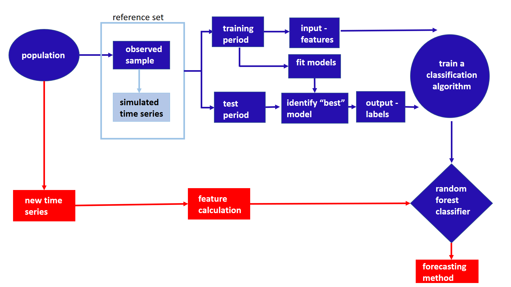

```{r initial, echo = FALSE, cache = FALSE, include = FALSE}
library(knitr)
opts_chunk$set(
  warning = FALSE, message = FALSE, echo = FALSE, 
  fig.path = 'figure/', cache.path = 'cache/', fig.align = 'center', 
  fig.show = 'hold', cache = TRUE, external = TRUE, dev = "pdf",
  fig.height = 5, fig.width = 8, out.width = "\\textwidth"
)
library(ggplot2)
#read_chunk('src/main.R')
```

\begin{abstract}
A crucial aspect in time series forecasting is the ability to identify the most suitable forecasting method. We present a general framework for forecast model selection using meta-learning approach. In contrast to the existing approaches, our method operates on features of the time series. A Random Forest approach is used to develop the meta-classifier. The proposed framework has been evaluated using the time series of the M1 and M3 competitions, and is shown to yield accurate forecasts comparable to several benchmarks and other commonly used automated approaches of time series forecasting.
\end{abstract}

\begin{keywords}
Time Series, Forecasting, Time Series Features, Random Forest, Meta-learning, Algorithm selection problem

\end{keywords}

\newpage
# Introduction

Forecasting is a key aspect for any businesses to operate efficiently. The rapid advances in computing technologies have enabled businesses to keep track of large number of time series variables. Hence, it is becoming increasingly common to have to regularly forecast many millions of time series. For example, large scale businesses often are interested in forecasting  sales, cost, demand for their thousands of products across different locations, warehouses, etc. Further, Google and Yahoo both collect many millions of daily time series such as web-click logs, web search counts, queries, revenue, number of users for different services such as YouTube, Facebook, etc.  In these circumstances, it is essential to have a tool to provide fast and accurate automatic forecasts. However, the scale of these tasks have raised some computational challenges that we seek to address by proposing a new fast algorithm for model selection and time series forecasting.

When there are a large number of time series to be forecast, a forecaster may either develop a single method to provide forecasts across all time series or develop a framework to select the most appropriate forecasting model or a combination of methods for each individual series. It is very unlikely that a single method will consistently outperform its competitors across all time series. In accordance with this, we adopt an individual model (or a combination of models) selection approach. However, selecting the most appropriate model or a combination of models for a given time series is not straight forward. The most common approach of individual model selection involves trying several models based on experienced analyst judgement on a given data set and the method which performs best for the hold-out sample is used to forecast future values of the time series. Despite its simplicity, in real time this approach is costly in terms of computing and experts' knowledge acquisition. Clearly, there is a need for automatic forecasting model selection method.

Two of the most commonly used automatic algorithms are the automated Exponential Smoothing Algorithm(ETS) of @Hyndman2002 and the automated ARIMA algorithm of @Hyndman2008. Both algorithms were implemented in the forecast package in R. In this paradigm, a class of models is selected in advance, and many models within that class are estimated for each time series. The model with the smallest AICc value is chosen and used to compute forecasts. This approach relies on the expert judgement of the forecaster in selecting the most appropriate class of models to use. However, it is not usually possible to use the AICc to compare models between classes due to differences in the way the likelihood is computed, and the way initial conditions are handled. An alternative approach which avoids selecting a class of models a priori is to use a time series cross-validation procedure. Then models from many different classes may be applied, and the model with the lowest cross-validated MSE selected. However, this increases the computation involved considerably (at least to order $n^2$ where $n$ is the number of series to be forecast). While either of these approaches may be implemented using parallel computing, they involve substantial computation which could be avoided if the features of the time series were used to select the class of models, or even the specific model, in advance.

In this paper we present a general framework for forecast model selection using a meta-learning approach. This is the basis of the algorithm we propose. In contrast to the existing approaches our method operates on the features of the time series. It involves computing a range of features of the time series which are then used to select the model to be used for forecasting. The model selection process is carried out using a classification algorithm --- we use the time series features as inputs, and the best forecasting algorithm as the output. The classification algorithm can be built in advance of the forecasting exercise (so it is an "offline" procedure). Then, when we have a new time series to forecast, we can quickly compute its features, use the pre-trained classification algorithm to identify the best forecasting model, and produce the required forecasts. Thus, the "online" part of our algorithm requires only feature computation, and the application of a single forecasting model, with no need to estimate large numbers of models within a class, or to carry out a computationally-intensive cross-validation procedure.

The rest of this paper is organized as follows. We review the related work in Section 2. In Section 3 we explain the detailed components and procedures of our proposed framework for forecast model selection. In section 4 we presents the results, followed by the conclusions and future work in Section 5.

\newpage
# Literature Review

## Time series features

The first step in the analysis of time series is usually to plot the data against time. This is known as instance based representation of time series. @tukey1988computer argued large dimensionality of data can make the viewing of graphs unrealistic due to the limits of human patience. He pointed out computers have no such limitations and measures calculated on data using computers will be potentially useful in a high dimensional setting. He called those measures "cognostics"-  computer aided diagnostics. This concept has been re-branded in the machine learning community as *features* or *characteristics*. In this paper we use the term *features*.

In the context of time series analysis any measurable characteristic of a time series is known as a *feature*. The set of features that represent a single time series are referred to as *feature vector* or *array of features*. For example, \autoref{timeseries} below shows the instance-based representation of six time series taken from the M3 competition database while \autoref{features1} shows the feature-based representation of the six time series. Here the features considered are the strength of seasonality and strength of trend which were calculated based on the measures introduced by @wang2009rule. Time series in the lower left quadrant of \autoref{features1} are non-seasonal but trended while there is only one series with both high trend and high seasonality. We also see how their degree of seasonality and trend varies. Measure of non-linearity, lag correlation, self-similarity and spectral-entropy are some other examples of time series features. 

@fulcher2014highly introduced 9000 operations to extract features from time series. This is the most recent work devoted to the feature-based representation of time series. However, the choice of the most appropriate set of features depends on the purpose of the study. In this paper we use the time series features for the purpose of forecast model selection. 

The features we consider should have the highest discriminatory power in accordance to the classification problem we have. Further, it is important to keep this set as small as possible in order to reduce the computational time.


```{r fig1, fig.cap="Instance-based representation of time series\\label{timeseries}", cache=T}
library(Mcomp)
# Loading M3 data
data(M3)
# Extract annual data
yearly_m3 <- subset(M3,"yearly")

# paper code
library(Mcomp)
data(M3)
# trend series
p1 <- autoplot(M3[["N0001"]])+theme(legend.position="none", axis.title.x=element_blank())
# random walk
p2 <- autoplot(M3[["N0633"]])+theme(legend.position="none", axis.title.x=element_blank())
p3 <- autoplot(M3[["N0625"]])+theme(legend.position="none", axis.title.x=element_blank())

# white noise
p4 <- autoplot(M3[["N0645"]])+theme(legend.position="none", axis.title.x=element_blank())
#trend+seasonality
p5 <- autoplot(M3[["N2012"]])+theme(legend.position="none", axis.title.x=element_blank())
# seasonality
p6 <- autoplot(M3[["N1912"]])+theme(legend.position="none", axis.title.x=element_blank())
library(gridExtra)
grid.arrange(p1, p2,p3, p4, p5, p6, ncol=3)
```

```{r fig2, fig.cap="Feature-based representation of time series\\label{features1}", cache=T}
paper_time <- list(M3[["N0001"]], M3[["N0633"]],M3[["N0625"]],M3[["N0645"]],M3[["N2012"]],M3[["N1912"]])
auto_arima_results <- lapply(paper_time, function(ts) as.character(auto.arima(ts$x))) 
auto_arima_results <- lapply(paper_time, function(ts) as.character(auto.arima(ts$x))) 

# calculation of strength of trend and seasonality

findfrequency <- function(x)
{
	n <- length(x)
	x <- as.ts(x)
	# Remove trend from data
	x <- residuals(tslm(x ~ trend))
	# Compute spectrum by fitting ar model to largest section of x
	n.freq <- 500
	spec <- spec.ar(c(na.contiguous(x)), plot=FALSE, n.freq=n.freq)
	if(max(spec[["spec"]])>10) # Arbitrary threshold chosen by trial and error.
	{
		period <- floor(1/spec[["freq"]][which.max(spec[["spec"]])] + 0.5)
		if(period==Inf) # Find next local maximum
		{
			j <- which(diff(spec[["spec"]])>0)
			if(length(j)>0)
			{
				nextmax <- j[1] + which.max(spec[["spec"]][(j[1]+1):n.freq])
				if(nextmax < length(spec[["freq"]]))
					period <- floor(1/spec[["freq"]][nextmax] + 0.5)
				else
					period <- 1L
			}
			else
				period <- 1L
		}
	}
	else
		period <- 1L
	
	return(as.integer(period))
}

decomp <- function(x,transform=TRUE)
{
	require(forecast)
	# Transform series
	if(transform & min(x,na.rm=TRUE) >= 0)
	{
		lambda <- BoxCox.lambda(na.contiguous(x))
		x <- BoxCox(x,lambda)
	}
	else
	{
		lambda <- NULL
		transform <- FALSE
	}
	# Seasonal data
	if(frequency(x)>1)
	{
		x.stl <- stl(x,s.window="periodic",na.action=na.contiguous)
		trend <- x.stl[["time.series"]][,2]
		season <- x.stl[["time.series"]][,1]
		remainder <- x - trend - season
	}
	else #Nonseasonal data
	{
		require(mgcv)
		tt <- 1:length(x)
		trend <- rep(NA,length(x))
		trend[!is.na(x)] <- fitted(gam(x ~ s(tt)))
		season <- NULL
		remainder <- x - trend
	}
	return(list(x=x,trend=trend,season=season,remainder=remainder,
							transform=transform,lambda=lambda))
}

measures <- function(x)
{
	require(forecast)
	
	N <- length(x)
	freq <- findfrequency(x)
	fx <- c(frequency=(exp((freq-1)/50)-1)/(1+exp((freq-1)/50)))
	x <- ts(x,f=freq)
	
	# Decomposition
	decomp.x <- decomp(x)
	
	# Adjust data
	if(freq > 1)
		fits <- decomp.x[["trend"]] + decomp.x[["season"]]
	else # Nonseasonal data
		fits <- decomp.x[["trend"]]
	adj.x <- decomp.x[["x"]] - fits + mean(decomp.x[["trend"]], na.rm=TRUE)
	
	# Backtransformation of adjusted data
	if(decomp.x[["transform"]])
		tadj.x <- InvBoxCox(adj.x,decomp.x[["lambda"]])
	else
		tadj.x <- adj.x
	
	# Trend and seasonal measures
	v.adj <- var(adj.x, na.rm=TRUE)
	if(freq > 1)
	{
		detrend <- decomp.x[["x"]] - decomp.x[["trend"]]
		deseason <- decomp.x[["x"]] - decomp.x[["season"]]
		trend <- ifelse(var(deseason,na.rm=TRUE) < 1e-10, 0, 
										max(0,min(1,1-v.adj/var(deseason,na.rm=TRUE))))
		season <- ifelse(var(detrend,na.rm=TRUE) < 1e-10, 0,
										 max(0,min(1,1-v.adj/var(detrend,na.rm=TRUE))))
	}
	else #Nonseasonal data
	{
		trend <- ifelse(var(decomp.x[["x"]],na.rm=TRUE) < 1e-10, 0,
										max(0,min(1,1-v.adj/var(decomp.x[["x"]],na.rm=TRUE))))
		season <- 0
	}
	
	m <- c(fx,trend,season)
	

	m <- c(trend, season)
	names(m) <- c("trend","seasonal")
	
	return(m)
}

library(ggrepel)
l <- lapply(paper_time, function(ts){measures(ts$x)})
df <- data.frame(matrix(unlist(l), nrow=6, byrow=T),stringsAsFactors=FALSE)
names(df) <- c("trend", "seasonality")
df$id <- c("N0001", "N0633", "N0625", "N0645", "N2012", "N1912")
ggplot(df, aes(x=trend, y=seasonality)) + geom_point()+coord_fixed()+
	geom_text_repel(
		aes(label=id, fill=factor(id)), colour="black",size=3, box.padding = unit(0.5, "lines")
	)+theme(legend.position="none")

```

\newpage
## What makes features useful for forecasting model identification?

@reid1972comparison pointed out that the performance of various forecasting methods changes according to the nature of data and if the reasons for these variations are explored they may be useful in selecting the most appropriate model. In response to the results of the M3-Competition [@makridakis2000m3] similar ideas have been reported by others, who argued that the characteristics of various time series may provide useful insights about which forecasting methods are most appropriate to forecast a given time series [@hyndman2001s;@lawrence2001s;@armstrong2001s].

Many of the time series forecasting techniques are developed to capture specific feature(s) of time series in a particular discipline. For example, GARCH models have been introduced to account for time-varying volatility in financial applications. Hence, an appropriate set of features reveals the structure of the time series there by uncovering the underlying best forecasting method. This is the main advantage of using features for forecasting model selection. Further, as discussed in the introduction, the existing approaches of forecasting model selection involve estimating several models on all time series and then selecting the method which provides the accurate forecasts for the hold-out set. Feature-based model selection approaches avoid the time associated with this trial and error procedure as we do not need to try several models on each series. 

Following the idea of feature-based representation of time series several researchers have introduced rules for forecasting based on features [@collopy1992rule;@adya2001automatic;@wang2009rule]. 
 @kang2017visualising applied principal component analysis to project a large collection of time series into 2D feature space to visualize what makes a particular forecasting method perform well or not in a particular domain or subset of time series. The features they considered are spectral entropy, first-order auto-correlation coefficient, strength of trend, strength of seasonality, seasonal period and optimal Box-Cox transformation parameter. On the side, they proposed a method for generating new time series based on features. 

## Algorithm Selection and Meta-learning Approach

John Rice is an early and strong proponent of the idea of meta learning which he called algorithm selection problem(ASP)[@rice1976]. The term *meta-learning* started to appear with the emerge of machine-learning literature. The Rice's framework for algorithm selection is shown in \autoref{fig:rice}.

```{r rice, fig.width=7,fig.height=5, fig.cap="Rice's framework for Algorithm Selection Problem (reproduced from Smith-Miles, 2009)"}

```


There are four main components in Rice's framework for ASP. The problem space $P$ represents the data sets used in the study. The feature space, $F$ is the range of measures that characterize the problem space $P$. The algorithm space $A$ is a list of suitable candidate algorithms which we can use to find solutions to the problems in $P$. The performance metric $Y$ is a measure of algorithm performance such as accuracy, speed, etc. Rice's formal definition of algorithm selection problem is [@smith2009cross]:

\begin{definition}
\label{def2}
For a given problem instance $x \in P$, with features $f(x) \in F$, find the selection mapping $S(f(x))$ into algorithm space $A$, such that the selected algorithm $\alpha \in A$ maximizes the performance mapping $y(\alpha(x)) \in Y$.
\end{definition}

The main challenge in ASP is to identify the selection mapping $S$ from
feature space to algorithm space. Even though, Rice's framework articulate
a conceptually rich framework, it is not clear the implementation from feature space to the algorithm space. This gives rise to the meta-learning approach. The main difference between the Rice's framework and the meta-learning approach is that the meta-learning framework consist of a offline(training) phase and online(prediction) phase. In the offline phase, the mapping $S$ is learned based on a previous record of training examples. This is performed by using a *meta-learner* which can be a any supervised learning algorithm. In other words, the meta-learner establishes rules to link the relationship between the feature space and the algorithm space. In the context of meta-learning, the inputs for the meta-learner are known as *meta-features* and instances in the algorithm space are the *output labels* of the meta learner. The database consists of both input-features and output-labels is called *meta-data*. In the offline phase of the algorithm input-features are extracted from new data and passed into the meta-learner constructed in the offline phase to predict output-labels of new data. The framework has attracted lot of research in recent as researchers are increasingly investigating how to identify the most suitable method among the existing algorithms for solving a problem rather than developing new algorithms. 

## Previous Work on Forecasting Model Selection using Meta-Learning

To address the problem of forecasting model selection several attempts have been taken in the context of meta-learning framework. In this section we briefly review some work that made an advance in this area.
In general forecasting model selection problems addressed in the literature can be framed according the definition of Rice's algorithm selection problem as follow:

\begin{definition}
\label{def2}
For a given time series $x \in P$, with features $f(x) \in F$, find the selection mapping $S(f(x))$ into algorithm space $A$, such that the selected algorithm $\alpha \in A$ minimizes forecasting accuracy error metric $y(\alpha(x)) \in Y$ on the test set of the time series.
\end{definition}


The methods introduced in literature differ with respect to the way they define - problem space($A$), features($F$), forecasting accuracy measure($Y$) and selection mapping ($S$).

@collopy1992rule introduced 99 rules based on 18 features of time series to make forecasts for economics and demographic time series. This work was further improved by @armstrong2001s reducing the human intervention.  @shah1997model used simple descriptive statistics, features related to dimentionality of time series and autocorrelation and partial autocorrelation based features to classify time series using discriminant analysis. More specifically,  the features are, number of observations, ratio of the number of turning points to the length of the series, ratio of number of step changes, skewness, kurtosis, coefficient of variation, autocorrelation at lag 1, 2, 3 and 4 and partial autocorrelation at lag 2, 3, and 4. Casting his work in Rice's framework: $P=203$ quarterly series of M-competition [@makridakis1982accuracy]; $A=3$ forecasting methods, namely simple exponential smoothing, Holt-Winters exponential smoothing with multiplicative seasonality and basic structural time series model; $Y=$ mean squared error for the hold-out sample. The mapping $S$ is learnt by using discriminant analysis. 

The work done by @prudencio2004meta was the first to use the term "meta-learning" in the context of time series model selection. They studied the applicability of meta-learning approaches for forecasting model selection based on two case studies. Using the notations of Rice's algorithm, for first case study, their algorithm space $A$, contained simple exponential smoothing method and time-delay neural network, $Y=$ mean absolute error, and the mapping $S$ was learnt by using C4.5 decision tree algorithm. The feature space, $F$ consisted 14 features, namely length, autocorrelation coefficients, coefficient of variation, skewness, kurtosis, and test of turning points to measure the randomness of the time series. For the second study,  random walk, Holt's linear exponential smoothing and AR models were considered in to the algorithm space $A$. The problem space $P$ contained, yearly series of M3 competition [@makridakis2000m3], F = subset of features from the first study and Y = ranking based on error. Beyond the task of forecasting model selection they used NOEMON approach to rank the algorithms [@kalousis1999noemon].

@lemke2010meta studied the applicability of different meta-learning approaches for forecasting model selection. Their algorithm space $A$ contained ARIMA models, exponential smoothing models and neural networks model. In addition to the statistical measures such as standard deviation of detrended series, skewness, kurtosis, length, strength of trend, Durbin-Watson statistics of regression residuals, number of turning points, step changes, predictability measure, non-linearity, largest Lyapunov exponent, and auto-correlation and partial-autocorrelation, he used frequency domain based features. The feed forward neural network, decision tree and support vector machine approaches were considered to learn the mapping $S$.

@wang2009rule used meta-learning framework to determine rules to provide recommendations as to which forecast method to use to generate forecasts. The rules are derived based on the relationship between time series features and forecasting method suitability. In order to evaluate the forecasting method suitability they introduced a new measure, namely, *simple percentage better(SPB)* which calculate the forecasting accuracy of a method against the forecasting accuracy error of random walk model. They used 9 features of time series namely, strength of trend, strength of seasonality, serial correlation, non linearity, skewness, kurtosis, self-similarity, chaos and periodicity. Later, this set of features has become a benchmark tool for many studies related to feature-based analysis of time series. According to the notation of Rice, the algorithm space $A=8$ forecasting methods namely, exponential smoothing, ARIMA, neural networks and random walk model, and the mapping $S$ between the features and performance of forecasting methods were learned by C4.5 algorithm for building decision trees. In addition to that, to understand the nature of time series in a two-dimensional setting they used SOM clustering on the features of the time series. The set of features introduced by @wang2009rule was later used by @widodomodel to develop a meta learning framework for forecasting model selection. The authors further reduced the dimensionality of time series by performing principal component analysis on the features. 

More recently, @kuck2016meta proposed meta-learning framework based on neural networks for forecasting model selection. Adopting the notation of Rice, $P = 78$ time series from NN3-competition was used to build the meta-learner. They introduced a new set of features based on forecasting errors. The average symmetric mean absolute percentage error was used to identify the best forecasting method for each series. They classify their forecasting models in the algorithm space as $A$, single, seasonal, seasonal-trend and trend exponential smoothing. The mapping $S$ was learned by using feed-forward neural network. Further, they evaluated the performance of different set of features for forecasting model selection.

# Methodology

The overview of the proposed framework is presented in \autoref{fig:framework}. The offline and the online part of the framework are shown in blue and red colours respectively. A classification algorithm (meta-learner) is trained under the offline phase and then is used to select appropriate forecasting models for new series (online phase). 

In order to train our classification algorithm, we need a large collection of time series which are similar to those that we will be forecasting. We assume that we have an essentially infinite population of time series, and we take a observed sample of them in order to train our classification algorithm. The new time series we aim to be forecasting are thought of as additional draws from the same population.  Hence, any conclusions made from the classification framework refer only to the population from which the sample has been selected. We may call this the target population. It is important to have a well defined target population to which the classification framework is applied in advance to avoid miss-applying the classification rules generated based on the available sample. We denote the collection of time series used for training the classifier as the "reference set". We split each time series within the reference set into a training set and a test set. From each training set we compute a range of time series features and also fit a selection of potential models. The calculated features form the input vector to the classification algorithm. Using the fitted models we generate forecasts and identify the "best" model for each training set based on forecast error measure (eg: MASE) calculated over the test set. The models deemed "best" form the output labels for the classification algorithm. The pseudo code for the algorithm implemented in this paper is given in Algorithm \autoref{alg:algo-lab}. In the following sections, we briefly introduce components associated with the offline part of the algorithm.


```{r framework, fig.cap="Proposed framework (blue: offline phase, red: online phase)"}


```


\begin{algorithm}
  \caption{Identification of "best" forecast method for a new time series}
  \label{alg:algo-lab}
  \begin{algorithmic}[1]
    \Statex \textbf{Offline phase}
    \Statex \text{Given:}
    \Statex \hspace{1cm}$O=\{t_1, t_2, ...t_n\}:$ the collection of $n$ observed time series
      \Statex \hspace{1cm}$L:$ the set of class labels (eg: ARIMA, ETS, SNAIVE, etc.)
         \Statex \hspace{1cm}$F:$ the set of functions to calculate time series features
         \Statex \hspace{1cm}$nsim:$ number of series to be simulated
         \Statex \hspace{1cm}$B:$ number of trees in the random forest
         \Statex \hspace{1cm}$mtry:$ number of features to be selected at each node
     \Statex \text{Output:}
      \Statex \hspace{1cm}\text{a random forest classifier} 
      \Statex
     \Statex \textit{Prepare the reference set}
    \Statex For $i=1$ to $n$
    \State Fit ARIMA and ETS models to $t_i$
    \State Simulate $nsim$ number of time series from each model in step 2
    \State The time series in $O$ and simulated time series in step 3 create the reference set $R=\{t_1, t_2, ...t_n, t_{n+1}....t_N\}$ where $N = n + nsim$.
    \Statex 
    \Statex \textit{Prepare the meta-data}
    \Statex For $j=1$ to $N$
    \State Split $t_i$ into training set and test set
    \State Calculate features $F$ based on the training set 
    \State Fit $L$ models to the training set
    \State Calculate forecasts for the test set from each model
    \State Calculate forecast error measure over the test set for all models in $L$
    \State Select the model with the minimum forecast error
    \State Meta-data: input features - step 7, output labels - step 11
     \Statex
    \Statex \textit{Train a random forest classifier}
    \State Train a random forest classifier based on the meta-data
    \State {Random forest: the ensemble of trees $\{T_b\}_1^B$} 
    \Statex
     \Statex \textbf{Online phase}
    \Statex \text{Given:}
    \Statex \hspace{1cm}\text{the random forest classifier in step 14} 
     \Statex \text{Output:}
      \Statex \hspace{1cm}\text{class labels for newly arrived time series $t_{new}$} 
  \State For $t_{new}$ calculate features $F$
  \State Let $\hat{C_b}(t_{new})$ be the class prediction of the $b^{th}$ random forest tree. Then class label for $t_{new}$ is $\hat{C_{rf}}(t_{new})=majorityvote{\hat{C_b}(t_{new})}$
   \end{algorithmic}
\end{algorithm}


## Augmenting the observed sample with simulated series

In practice, we may wish to augment our reference set by simulating new time series that are similar to those from the population. This process may be useful when our observed sample of time series is too small to build a reliable classifier. Alternatively, we may wish to add more of some types of time series to the reference set in order to get a more balanced sample for the classification.
In order to produce simulated series that are similar to our population, we use several standard automatic forecasting algorithms such as ETS or automated ARIMA models, and then simulate multiple time series from the selected model within each model class. Assuming the models used are appropriate to the data, this ensures that the simulated series are similar to those in the population. Note that, this is done in the off-line phase of the algorithm, the computational time in producing these simulated series is of no real consequence.

## Input: features

Our proposed algorithm depends crucially on finding features that enable identification of a suitable model for the given time series. Therefore, the features used should capture the dynamic structure of the time series which is important for identifying models for forecasting. Such features are measures related to the auto-correlation structure of the time series, the trend, the seasonality (if the data is seasonal) and nonlinearlity.

The purpose of this feature-based framework is to lessen the workload associated with the trial and error procedure of model selection and thereby reduce this time. Therefore, we must be conscious that the time taken to calculate the input features should be significantly less than the time taken to estimate parameters of all of the candidate models required in a model selection procedure. Furthermore, interpretability, robustness to outliars, scale and length independence are some other factors that should be taken into consideration when selecting features for this classification problem. A comprehensive description of the features used in the experiment is specified in \autoref{sec:features}.

## Output: labels

The task of our classification framework is to identify the best forecasting method for a given time series. In this study we define the best forecast method for a given time series as the model which performs well for the out of sample according to some accuracy measure (for example, MAPE, MASE etc). The measure we use to select the best forecasting model could vary according to the purpose of forecasting and it could be either multiple or single criteria.

In real life it is not possible to train time series among all possible classes of time series models to identify the best forecasting method, but at least we have to consider enough possibilities so that the algorithm can be used for out of sample classification with high confidence. However, the models to be considered will depend on the specific population of time series models we need to forecast. For example, if we have only non-seasonal time series, and no chaotic features, we may wish to restrict our models to random walks, white noise, ARIMA processes and ETS processes. Even in this scenario, the number of possible models can be quite large. In order to identify the best forecasting method for each series, all the methods considered are run on all time series in the reference set and generate forecasts. It is important to note that the model estimation is done on the training part of each series and forecasts are compared with the values in the test set. It is apparent that this step is computationally intensive and time consuming, as all methods have to be tried on each and every series in the reference set.  Since, this is done in the offline phase the time and the computational cost associated with this is not a problem.

## Random forest algorithm

Having described the data inputs and outputs for the supervised classification approach, we briefly review the random forest algorithm for classification [@breiman2001random]. Random Forest is an ensemble learning method that grows a large number of decision trees using a two-step randomization process.

The algorithm works as follow: Let $S=\{(\underline{x_1}, y_1), (\underline{x_2}, y_2), \dots, (\underline{x_N}, y_N)\}$ be the reference set, where the input $\underline{x_i}$, is a $1\times F$ vector of features, the output, $y_i$ corresponds to the class label of the $i^{th}$ observation, and $F$ is the total number of features. $N$ is the number of training examples in the reference set. Each tree in the forest is grown based on a bootstrap sample of size $N$ from the reference set. At each node of the tree, randomly select $f$ features from the full set of features $F$. The best split is selected  among those $f$ features. The split which results in most homogeneous sub-node is considered as the best split. Various measures have been introduced to evaluate the homogeneity of subnodes, such as; classification error rate, Gini index and cross entropy [@friedman2001elements]. In this study, we use Gini index to evaluate the homogeneity of a particular split. The trees are grown to the largest extent possible without pruning. To determine the class label for a new instance, features are calculated and passed down the trees. Then each tree gives a prediction and the majority vote over all individual trees lead to the final decision. In this work, we used the randomForest package [@liaw2002randomforest] in R which implements the Fortran code for the Random Forest classification, by @breiman2004random.

# Application to M-competition data

To test how well our proposed framework can identify the suitable forecasting models, we use the time series of the M1-competition [@makridakis1982accuracy] and M3 competition [@makridakis2000m3]. The R package Mcomp [@hyndmanmcomp] accompanies the data of M1 and M3 competitions. The proposed algorithm is applied to yearly, quarterly and monthly series separately.  We run two experiments on each case. In the first experiment we treat the time series of M1 competition as the *observed sample* and the time series of M3 competition as the collection of *new time series*. We run the second experiment by considering the M3 data as the *observed sample* and the M1 data as the *new time series* collection. Note that, the all phrases are consistent with the components in \autoref{fig:framework}. This allow us to compare our results with those of the literature. In both experiments, we fit ARIMA and ETS models to the full length of each series in the corresponding *observed sample* based on `auto.arima` and `ets` functions in the forecast package [@Hyndman2008]. Subsequently, from each model we further simulate 1000 series. For monthly time series, we further simulate 100 series from each model to fasten the offline calculation process. The lengths of simulated time series are set equal to the lengths of the corresponding series in the M-competition.

As shown in \autoref{fig:framework}, the task of constructing the meta-database contains two main components, (i) identification of *output-label* and (ii) feature computation process. In the forthcoming paragraph we will first discuss the process of identifying *output-labels*, followed by an overview of the features used in the experiment.

The output-labels we consider in this experiment are,

i) White noise process (WN)

ii) AR/ MA/ ARMA

iii) ARIMA

iv) Random walk with drift (RWD)

v) Random walk (RW)

vi) The Theta method 

vii) STL-AR: STL decomposition method is applied to the time series and AR models is fitted to the seasonally adjusted time series while seasonal naive method is used to forecast the seasonal component.

viii) Exponential Smoothing Model (ETS) without trend and seasonal components

ix) ETS with trend component and without seasonal component

x) ETS with damped trend component and without seasonal component

In addition to the above ten(10) output labels, for seasonal data, we further include the following five class labels,

xi) ETS with trend and seasonal components

xii) ETS with damped trend and seasonal components

xiii) ETS with seasonal components and without trend component
ix) SARIMA

x) Seasonal naive method.

Therefore, in accordance to Rice's framework, for yearly data, the algorithm space($A$) contains 10 models while for seasonal data the algorithm space($A$) contains 15 models.

Inorder to identify the output label: "best" model, RW, RWD, Theta, STL-AR, Seasonal naive (only for seasonal time series), WN are implemented on training set of each series and forecasts are produced for the whole of the test sets. In addition, we further use `auto.arima` and `ets` functions in the forecast package to identify suitable AR/MA/ARMA, ARIMA, SARIMA and ETS model. The model model corresponds to the smallest MASE [@hyndman2006another] for the test set is selected as the *output-lable*. 
 

## Feature computation process
\label{sec:features}

We use a set of 25 features for yearly data and a set of 30 features for seasonal data, spanning from simple attributes like, length of series, to slightly complex ones, like spectral entropy. Some of the features  are already established features from previous studies [@wang2009rule; @hyndman2015large; @kang2017visualising]. We have also added some new features that we believe provide some useful information. These are summarized in \autoref{feature}. For a full description of each feature please refer to Appendix 1.


\newpage

\newcommand{\boxedcheckmark}
  {{\ooalign{$\Box$\cr\hidewidth$\checkmark$\hidewidth}}}


\begin{table}[!h]
\centering
\caption{Feature description}
\label{feature}
\begin{tabular}{l|llcc}
\hline
\multicolumn{2}{c}{Feature} & Description & non-seasonal &  seasonal\\ \hline
   1        &   N        & length of the time series & $\checkmark$ & $\checkmark$ \\ 
    2     &   trend        & strength of trend & $\checkmark$ &  $\checkmark$\\ 
    3       &    seasonal       & strength of seasonality & - & $\checkmark$  \\ 
    4     &  linearity         &linearity  & $\checkmark$  & $\checkmark$ \\
    5       &     curvature      & curvature & $\checkmark$ &  $\checkmark$ \\ 
    6       &  spikines         &  spikines  & $\checkmark$ & $\checkmark$ \\ 
  7      &   e\_acf1        & first autocorrelation coefficient of the remainder series & $\checkmark$ & $\checkmark$  \\
        8   &  stability         & stability & $\checkmark$ & $\checkmark$ \\ 
      9       &     lumpiness      & lumpiness & $\checkmark$ & $\checkmark$ \\ 
      10    &       entropy    &  spectral entropy & $\checkmark$ & $\checkmark$ \\ 
            11   &  hurst         & Hurst exponent & $\checkmark$ & $\checkmark$ \\ 
               12        &     nonlinearity      & nonlinearity & $\checkmark$\ & $\checkmark$ \\ 
                   13       &    alpha       &   Holt's linear trend model-$\hat\alpha$ & $\checkmark$ &  $\checkmark$ \\ 
   14        &   beta        &   Holt's linear trend model-$\hat\beta$   & $\checkmark$ &  $\checkmark$\\ 
       15       &    hwalpha       & Holt-Winters addtive method - $\hat\alpha$ & - &  $\checkmark$ \\ 
    16       &    hwbeta       & Holt-Winters addtive method - $\hat\beta$ & - & $\checkmark$ \\ 
    17       &    hwgamma       & Holt-Winters addtive method - $\hat\gamma$ & - & $\checkmark$  \\ 
      18         &    ur\_pp       & test statistic based on Phillips-Perron test & $\checkmark$ & - \\ 
   19     &     ur\_kpss      & test statistic based on kpss test & $\checkmark$ & - \\ 
      20    &   x\_acf1        &  \vtop{\hbox{\strut first autocorrelation coefficient}\hbox{\strut of the original series}} & $\checkmark$ & $\checkmark$ \\ 
       21    &  diff1x\_acf1         & \vtop{\hbox{\strut first autocorrelation coefficient}\hbox{\strut of the differenced series}} & $\checkmark$ & $\checkmark$ \\ 
      22   &   diff2x\_acf1        & \vtop{\hbox{\strut first autocorrelation coefficient}\hbox{\strut of the twiced-differenced series}} & $\checkmark$ & $\checkmark$ \\ 
      23        &   x\_acf5        & \vtop{\hbox{\strut sum of squared of first 5  }\hbox{\strut autocorrelation coefficients of the original series}} & $\checkmark$ & $\checkmark$ \\ 
   24     &   diff1x\_acf5        & \vtop{\hbox{\strut sum of squared of first 5 autocorrelation  }\hbox{\strut coefficients of the differenced series}} & $\checkmark$ & $\checkmark$ \\ 
   25        &    diff2x\_acf5         & \vtop{\hbox{\strut sum of squared of first 5  autocorrelation }\hbox{\strut coefficients of the twice-differenced series}} & $\checkmark$ & $\checkmark$ \\ 
    26       &    seas\_acf1       & autocorrelation coefficient at first lag & - & $\checkmark$   \\ 
     27     &     sediff\_acf1      &   \vtop{\hbox{\strut first autocorrelation coefficient}\hbox{\strut of the seasonally-differenced series}} & - &  $\checkmark$\\ 
   28      &   sediff\_seacf1        &  \vtop{\hbox{\strut first autocorrelation coefficient at the first seasoanl lag  }\hbox{\strut of the seasonally-differenced series}} & - & $\checkmark$ \\  
   29 &    sediff\_acf5       & \vtop{\hbox{\strut sum of squared of first 5 autocorrelation coefficients}\hbox{\strut of the seasonally-differenced series}} & - & $\checkmark$ \\ 
    30      &   lmres\_acf1        & \vtop{\hbox{\strut first autocorrelation coefficient  }\hbox{\strut of the residual series of linear trend model}}  &  $\checkmark$ & -  \\ 
       31     &    x\_pacf5       & \vtop{\hbox{\strut sum of squared of first 5 partial autocorrelation }\hbox{\strut coefficients of the original series}}   & $\checkmark$ & $\checkmark$ \\ 
32        &    diff1x\_pacf5       & \vtop{\hbox{\strut sum of squared of first 5 partial autocorrelation }\hbox{\strut coefficients of the differenced series}} & $\checkmark$ & $\checkmark$ \\ 
    33     &    diff2x\_pacf5       & \vtop{\hbox{\strut sum of squared of first 5 partial autocorrelation }\hbox{\strut coefficients of the twice-differenced series}} & $\checkmark$ & $\checkmark$ \\ \hline
 \end{tabular}
\end{table}

\newpage

## Model calibration

Our reference set is imbalanced: some classes contains significantly more cases than the other classes. The degree of class imbalance to some extent by augmenting the observed sample with simulated time series. The random forests algorithm is highly sensitive to the class imbalance [@breiman2001random]. We use three approaches to address the class imbalance in the data: i) incorporate class priors into the random forest classifier,  and ii) use Balanced Random Forest(BRF) algorithm introduced by @chen2004using and iii) re-balancing the reference set with down sampling. Note, that BRF algorithm is different from down-sampling approach. In down sampling thereference set is pre-processed by down-sampling the majority class into the size of the minority class which is potentially discard some useful information. We compare the results of above three random forests to the random forest classifier build on imbalanced data. The RF algorithms are implemented by the randomForest R package [@liaw2002randomforest]. The class priors are introduced through the option `classwt`. We use reciprocal of class size as class priors. In each case the two parameters of the of RF algorithm are set as: number of trees(*ntree*) - 1000, and number of randomly selected features(*mtry*) - one third of the total number of features. The number of trees are limited to 1000 to fasten the online calculation process. The Random forest trained on unbalanced data (RF-unbalanced) and 


## Summary of the main results
\label{sec:results}

The matrices of Pearson correlation coefficients for all the features in the reference sets of each experiments are presented in \autoref{fig:cormat}. Although the correlations among particular features are of interest the focal point of \autoref{fig:cormat} is the entire matrix of correlation coefficients. The degree of variability in the Pearson's correlation coefficients between features indicate the diversity of the selected features. In other words the features we used were able to capture the different characteristics of the time series. Further, the structure of correlation matrices are similar to each other Random forest with class priors (RF-class priors) outperform the other methods.


```{r cormat,  fig.width=7,fig.height=9, fig.cap=" Correlation matrix plots (A-Experiment1 yearly, B- Experiment 2 yearly, C- Experiment 1, quarterly, D- Experiment 2 quarterly, E - Experiment 1 monthly, F - Experiment 2 monthly)"}
library(grid)
library(gridExtra)
library(png)

img1 <-  rasterGrob(as.raster(readPNG("figures/ggheatmapA.png")), interpolate = FALSE)
img2 <-  rasterGrob(as.raster(readPNG("figures/ggheatmapB.png")), interpolate = FALSE)
img3 <-  rasterGrob(as.raster(readPNG("figures/ggheatmapC.png")), interpolate = FALSE)
img4 <-  rasterGrob(as.raster(readPNG("figures/ggheatmapD.png")), interpolate = FALSE)
img5 <-  rasterGrob(as.raster(readPNG("figures/ggheatmapE.png")), interpolate = FALSE)
img6 <-  rasterGrob(as.raster(readPNG("figures/ggheatmapF.png")), interpolate = FALSE)
grid.arrange(img1, img2, img3, img4, img5, img6, ncol = 2)

```


We now presents the results of our experiments on yearly, quarterly and monthly series separately. We build separate random forest classifiers to yearly data, quarterly data and monthly data. In each case, for the second experiment(M3-observed sample, M1-new series) we take a subset of simulated time series to train the RF-unbalanced and RF-class priors as `randomForest` package does to facilitate in handling large data sets. The subsets are selected randomly according to the proportions of output-labels in the observed samples. This ensures that our reference set shares the similar characteristics of the observed sample. The principal component analysis is use to visualize the relationship between feature-space of the different time series collections: observed time series, simulated time series, subset of simulated time series and new time series. For each experiment, principal component analysis(PCA) is performed on all the features in the observed sample. Then we project the simulated time series and the new time series into the PCA space of the observed data. The results are shown in \autoref{fig:pca1} - \autoref{fig:pca3}, for yearly, quarterly and monthly data respectively. On each experiment the first three principal components are plotted against each other. The point on each graph represents a time series.


The accuracy of our method is compared against following benchmarks and other commonly used approaches of forecasting:

  1. automated ARIMA algorithm of @Hyndman2008
  
  2. automated ETS algorithm of @Hyndman2008
  
  3. Random walk with drift(RWD)
  
  4. Random walk model(RW)
  
  5. White noise process(WN)
  
  6. Theta method
  
  7. STL-AR method
  
  8. seasonal naive(for seasonal data)

The automated ARIMA and ETS algorithms are implemented using `auto.arima` and `ets` functions available in the forecast package in R[@Hyndman2008]. Each method is implemented on the training set and forecasts are computed up to the full length of the test set. Then we compute the MASE for each forecast horizon, by averaging the MASE across all series in the the collection of new times series. Further, to assist in the evaluation of the proposed framework, for each forecast horizon we rank our method compared to the other methods listed above and and average ranking over all forecast horizons are computed. The results are given in \autoref{YM3} - \autoref{M1M}. The MASE value corresponds to the best performing method in each category is highlighted in bold.

**Yearly data**


For the yearly series in M1 competition, the first 3 principal components explain 62.47% of the variation of features. For the yearly series in M3 competition, the first three principal components explains 62.19% of the total variance.   As seen in \autoref{fig:pca1}, simulated time series are able to fill the gap appeared between the points in the observed sample. By augmenting the reference set with simulated time series we were able to increase the diversity and evenness(to some extent) of the feature space of observed time series. Further, in both experiments, all the *observed time series* falls within the space of all simulated data. This guarantees that we have not lost any feature structures of the observed sample. The remaining plots in \autoref{fig:pca2}-\autoref{fig:pca3} can be interpreted similar to \autoref{fig:pca1}.

The \autoref{YM3} to \autoref{YM1} compare the performance of our proposed framework to the benchmark methods. For each method we calculate out-of-sample MASE over the forecast horizons 1-h, and average over all time series. For yearly series of M3 competition random walk with drift model seem to be inferior to the other methods. The average MASE values corresponds to the RF-class priors are slightly higher than the results of random walk with drift. For yearly series of M1 competition RF-unbalanced and RF-class priors consistently forecast more accurately than random walk with drift model. 


```{r pca1, fig.width=7,fig.height=5, fig.cap="Distribution of yearly time series in the PCA space; results of experiment 1 (observed sample-M1, new time series - M3) are shown in panels 1.A- 1.C and results of experiment 2 (observed sample-M3, new time series - M1) are shown in panels 2.A- 2.C, on each graph colour scheme is green-simulated time serie, yellow-subset of simulated time series, black-observed time series, orange-new time series"}
library(grid)
library(gridExtra)
library(png)
img1 <-  rasterGrob(as.raster(readPNG("figures/pca1M1Y.png")), interpolate = FALSE)
img2 <-  rasterGrob(as.raster(readPNG("figures/pca2M1Y.png")), interpolate = FALSE)
img3 <-  rasterGrob(as.raster(readPNG("figures/pca3M1Y.png")), interpolate = FALSE)
img4 <-  rasterGrob(as.raster(readPNG("figures/pca1M3Y.png")), interpolate = FALSE)
img5 <-  rasterGrob(as.raster(readPNG("figures/pca2M3Y.png")), interpolate = FALSE)
img6 <-  rasterGrob(as.raster(readPNG("figures/pca3M3Y.png")), interpolate = FALSE)
grid.arrange(img1, img2, img3, img4, img5, img6, ncol = 3)

```


\begin{table}[!h]
\centering
\caption{Experiment 1 (Observed sample - M1): Forecast accuracy measures for 645 M3-yearly series}
\label{YM3}
\begin{tabular}{lrrrrrrr}
\hline
 & \multicolumn{6}{c}{Average of forecasting horizons: 1-h} \\ \hline
 & 1  & 1-2  & 1-3  & 1-4 & 1-5 & 1-6 & Average Rank \\ \hline
 RF-unbalanced & 1.06  &  1.42 & 1.83  & 2.20 & 2.54 & 2.85 & 3.50 \\ 
 RF-class priors& \bf{1.03}  & 1.37  & 1.78  & 2.14 & 2.47 & 2.77 & 1.83 \\ 
auto.arima &  1.11 & 1.48  & 1.90  & 2.28 & 2.63 & 2.96 & 6.83 \\ 
ets&   1.09  & 1.44  & 1.84 & 2.20 & 2.54 & 2.86 & 4.17\\ 
WN&    6.54  & 6.91  & 7.22 & 7.48 &7.76  & 8.07 & 9.00\\ 
RW &    1.24  & 1.68  & 2.11 & 2.48 & 2.83 & 3.17 &8.00 \\ 
RWD&   \bf{1.03}  & \bf{1.36}  & \bf{1.74} & \bf{2.05} & \bf{2.35} & \bf{2.63} &1.17 \\ 
STL-AR & 1.09  &  1.47 &  1.89 & 2.27 & 2.62 & 2.95 & 5.50 \\ 
Theta & 1.12  & 1.47  & 1.86  & 2.18 & 2.48 & 2.77 & 4.17 \\ \hline
\end{tabular}
\end{table}

\newpage
\begin{table}[!h]
\centering
\caption{Experiment 2 (Observed sample - M3): Forecast accuracy measures for 181 M1-yearly series}
\label{YM1}
\begin{tabular}{lrrrrrrr}
\hline
 & \multicolumn{6}{c}{Average of forecasting horizons: 1-h} \\ \hline
 & 1  & 1-2  & 1-3  & 1-4 & 1-5 & 1-6 & Average Rank \\ \hline
 RF-unbalanced & \bf{0.97}  & \bf{1.39}  & 1.93  & 2.42 & 2.90 & 3.37 & 1.67 \\ 
 RF-class priors& 1.02  & 1.40 &  \bf{1.92} & \bf{2.40} & \bf{2.87}  & \bf{3.33} &1.33  \\ 
auto.arima &  1.06 & 1.47  & 2.01  & 2.51 & 3.00 & 3.47 & 3.50 \\ 
ets&   1.12  & 1.59  & 2.17 & 2.72 & 3.26 &3.77  & 6.00\\ 
WN&    6.38  & 7.08  & 7.92 & 8.59 & 9.28 & 10.01 & 9.00\\ 
RW &    1.35  & 2.00  & 2.80 & 3.50 & 4.19 & 4.89 & 8.00\\ 
RWD&    1.03  & 1.44  & 2.00 & 2.51 & 3.01 & 3.49 & 3.33 \\ 
STL-AR & 1.10 &  1.51 &  2.07 & 2.55 & 3.04 & 3.52 & 5.00 \\ 
Theta & 1.15  & 1.70  & 2.38  & 3.00 & 3.59 & 4.19 & 7.00 \\ \hline
\end{tabular}
\end{table}

### Quarterly data

The first 3 principal components  quarterly time series in the M1 competition explain 62.40% of the total variance of the features while for the quarterly series in the M3-competition data, the amount of variation explained by the first 3 principal components is 64.75%. 

\autoref{M3Q} to \autoref{M1Q} summarize the results for quarterly data. The results of RF-class priors outperform the the benchmark methods.  However, the average MASE of Theta method for 1-18 slightly lower than the RF-unbalanced and RF-class priors. 

```{r pca2,fig.cap="Distribution of quarterly time series in the PCA space; results of experiment 1 (observed sample-M1, new time series - M3) are shown in panels 1.A- 1.C and results of experiment 2 (observed sample-M3, new time series - M1) are shown in panels 2.A- 2.C, on each graph colour scheme is green-simulated time serie, yellow-subset of simulated time series, black-observed time series, orange-new time series"}
library(grid)
library(gridExtra)
library(png)

img1 <-  rasterGrob(as.raster(readPNG("figures/pca1M1Q.png")), interpolate = FALSE)
img2 <-  rasterGrob(as.raster(readPNG("figures/pca2M1Q.png")), interpolate = FALSE)
img3 <-  rasterGrob(as.raster(readPNG("figures/pca3M1Q.png")), interpolate = FALSE)
img4 <-  rasterGrob(as.raster(readPNG("figures/pca1M3Q.png")), interpolate = FALSE)
img5 <-  rasterGrob(as.raster(readPNG("figures/pca2M3Q.png")), interpolate = FALSE)
img6 <-  rasterGrob(as.raster(readPNG("figures/pca3M3Q.png")), interpolate = FALSE)
grid.arrange(img1, img2, img3, img4, img5, img6, ncol = 3)

```


\begin{table}[!h]
\centering
\caption{Experiment 1 (Observed sample - M1): Forecast accuracy measures for 756 M3 - quarterly series}
\label{M3Q}
\begin{tabular}{lrrrrrrrrrl}
\hline
 & \multicolumn{8}{c|}{Average of forecasting horizons: 1-h}    &  \\ \hline
 &  1& 1-2 & 1-3 & 1-4 & 1-5 & 1-6 & 1-7 & 1-8  & Average rank  \\ \hline
RF-unbalanced& 0.58 & \bf{0.65} & \bf{0.73} & \bf{0.81} & \bf{0.88} & \bf{0.96} & \bf{1.04} & 1.12 & 1.25  \\ 
RF-class priors & 0.58&  0.66& 0.74 & 0.81 & 0.89 & 0.97 & 1.05 & 1.13   & 2.38   \\ 
auto.arima & 0.58 & 0.66  & 0.75 & 0.85 & 0.93 & 1.01 & 1.10 & 1.19 & 4.25 \\ 
ets & \bf{0.56} & \bf{0.65}  & \bf{0.73} & 0.82 & 0.91 & 0.99 & 1.08 & 1.17 & 2.75   \\ 
WN & 3.25 & 3.35 & 3.46 & 3.59 & 3.63 & 3.70 & 3.78 & 3.87 & 10.00   \\ 
RW & 1.14 & 1.12 & 1.17 & 1.16 & 1.25 & 1.32 & 1.41 & 1.46 &  7.38  \\ 
RWD & 1.20 & 1.18 & 1.23 & 1.17 & 1.29 & 1.36 & 1.44 & 1.47 & 8.38   \\ 
STL-AR & 0.70 & 0.90 & 1.08 & 1.27 & 1.44 & 1.60 & 1.75 &  1.91 & 7.88   \\ 
Theta & 0.62 & 0.68 & 0.76 & 0.83 & 0.90 & 0.97 & 1.04 &  \bf{1.11} & 3.25  \\ 
Snaive & 1.11 & 1.10 & 1.08 & 1.09 & 1.21 & 1.30 & 1.36 & 1.43 &  6.25  \\ \hline
\end{tabular}
\end{table}

\begin{table}[!h]
\centering
\caption{Experiment 2 (Observed sample - M3): Forecast accuracy measures for 203 M1 - quarterly series}
\label{M1Q}
\begin{tabular}{lrrrrrrrrrl}
\hline
 & \multicolumn{8}{c}{Average of forecasting horizons: 1-h}    &  \\ \hline
 &  1& 1-2 & 1-3 & 1-4 & 1-5 & 1-6 & 1-7 & 1-8  & Average rank  \\ \hline
 RF-unbalanced& \bf{0.77} & \bf{0.85} & \bf{0.95} & \bf{1.08} & \bf{1.22} & \bf{1.36} & \bf{1.48} & \bf{1.59} & 1.00  \\ 
RF-class priors & 0.79 &0.88  & 0.99 & 1.12 & 1.28 & 1.41 &  1.53& 1.65 &2.25    \\ 
auto.arima & 0.85 & 0.94 & 1.05 & 1.19 & 1.37 & 1.53& 1.67 & 1.80 & 5.00  \\ 
ets & 0.78 & 0.89  & 0.98 & 1.11 & 1.28 & 1.42 & 1.54 & 1.66 &  2.50  \\
WN & 3.97 & 4.14 & 4.16 & 4.27 & 4.35 & 4.45 & 4.52 & 4.64 & 10.00   \\ 
RW & 0.97 & 1.10 & 1.25 & 1.35 & 1.52 & 1.67 & 1.83 & 1.95 & 7.13  \\ 
RWD & 0.95 & 1.04 & 1.19 & 1.26 & 1.42 & 1.56 & 1.71 & 1.81 &  6.00  \\ 
STL-AR & 0.96 & 1.20 & 1.41 & 1.63 & 1.85 & 2.05 & 2.23 &  2.43 & 8.50   \\ 
Theta & 0.79 & 0.90 & 1.00 & 1.13& 1.29 & 1.42 & 1.55 &  1.67 &  3.75 \\ 
Snaive & 1.52 & 1.53 & 1.53 & 1.56 & 1.74 & 1.86 & 1.98 & 2.08 & 8.38   \\ \hline
\end{tabular}
\end{table}

\newpage

### Monthly data

For monthly series of M1 competition the first three principal components capture 78.07% of the variability in the 30 features, while for the monthly series of M3 competition the amount of variation captured by the first three principal components is 65.97%. According to the results of \autoref{M3M} and \autoref{M1M}, RF-unbalanced and RF-class priors seem to be inferior to other methods for long-term forecast horizons (h=1 to 18).


```{r pca3,fig.cap="Distribution of monthly time series in the PCA space; results of experiment 1 (observed sample-M1, new time series - M3) are shown in panels 1.A- 1.C and results of experiment 2 (observed sample-M3, new time series - M1) are shown in panels 2.A- 2.C, on each graph colour scheme is green-simulated time serie, black-observed time series, orange-new time series"}

library(grid)
library(gridExtra)
library(png)

img1 <-  rasterGrob(as.raster(readPNG("figures/pca1M1M.png")), interpolate = FALSE)
img2 <-  rasterGrob(as.raster(readPNG("figures/pca2M1M.png")), interpolate = FALSE)
img3 <-  rasterGrob(as.raster(readPNG("figures/pca3M1M.png")), interpolate = FALSE)
img4 <-  rasterGrob(as.raster(readPNG("figures/pca1M3M.png")), interpolate = FALSE)
img5 <-  rasterGrob(as.raster(readPNG("figures/pca2M3M.png")), interpolate = FALSE)
img6 <-  rasterGrob(as.raster(readPNG("figures/pca3M3M.png")), interpolate = FALSE)
grid.arrange(img1, img2, img3, img4, img5, img6, ncol = 3)

```

\begin{table}[!h]
\centering
\caption{Experiment 1 (Observed sample - M1): Forecast accuracy measures for 1428 M3 - monthly series}
\label{M3M}
\begin{tabular}{lrrrrrrrr}
\hline
 & \multicolumn{6}{c}{Average of forecasting horizons: 1-h}    &  \\ \hline
 &  1-4& 1-6 & 1-8 & 1-10 & 1-12 & 1-18  & Average rank  \\ \hline
RF-unbalanced&  0.66& 0.69 & 0.72 & 0.75 & 0.75 & 0.78 & 5.17  \\ 
RF-class priors &  0.65& 0.68 & 0.71 & 0.74 & \bf{0.74} & \bf{0.77}  & 4.00  \\ auto.arima & 0.61 & 0.65 & 0.69 & 0.72 & 0.75 & 0.88 &  2.67   \\  
ets & \bf{0.59}  & \bf{0.64} & \bf{0.68} & \bf{0.72} & \bf{0.74} & 0.86 & 1.67   \\  
WN & 2.06 & 2.08 & 2.10 & 2.13 & 2.15 & 2.27 & 12.00   \\  
RW &0.91  &0.97  & 1.01 & 1.04 & 1.04 & 1.17 & 10.33  \\ 
RWD &0.90  & 0.96 &1.00  &1.03  & 1.02 & 1.14 & 9.17  \\ 
STL-AR & 0.73 & 0.81 & 0.90 & 0.98 & 1.04 & 1.27 & 8.83  \\ 
Theta & 0.63 & 0.67 & 0.72 & 0.75 & 0.77 & 0.89 & 5.67    \\ 
Snaive& 0.95 & 0.97 & 0.97 & 0.98 & 0.98 &  1.14& 9.00  \\ \hline
\end{tabular}
\end{table}
\newpage

\begin{table}[!h]
\centering
\caption{Experiment 2 (Observed sample - M3): Forecast accuracy measures for 617 M1 - monthly series}
\label{M1M}
\begin{tabular}{lrrrrrrrl}
\hline
 & \multicolumn{6}{c}{Average of forecasting horizons: 1-h}    &  \\ \hline
 &  1-4& 1-6 & 1-8 & 1-10 & 1-12 & 1-18  & Average rank  \\ \hline
RF-unbalanced&  0.72& 0.78 & 0.83 & 0.88 &\bf{ 0.89} & \bf{0.97} & 2.50  \\ 
RF-class priors &  0.71& 0.78 & 0.83 & 0.89 & 0.91 & 0.99  & 2.83  \\ 
auto.arima & 0.73 &0.81  & 0.87 & 0.94 & 0.99 & 1.16 &  6.83   \\  
ets &0.68  & 0.76 & 0.82 & 0.88 & 0.93 & 1.07 & 2.50   \\  
WN & 2.06 & 2.09 & 2.12 & 2.14 & 2.18 & 2.28 & 12.00   \\  
RW &1.18  &1.24 & 1.31 & 1.34 & 1.33 & 1.47 &  10.00 \\ 
RWD &1.19  & 1.27 &1.37  &1.40  & 1.39 & 1.55 & 11.00  \\ 
STL-AR & 0.79 & 0.91 & 0.99 & 1.09 & 1.17 & 1.39 & 8.33  \\ 
Theta & \bf{0.68} & \bf{0.75} & \bf{0.81} & \bf{0.87} & 0.91 & 1.04 & 1.67    \\ 
Snaive& 1.09 & 1.11 & 1.11 & 1.13 & 1.14 &  1.31&   8.67\\ \hline
\end{tabular}
\end{table}

# Discussion and Conclusions

In this paper we propose a novel framework for forecasting model selection using mete-learning approach. Our proposed framework oriented towards the automatic selection of forecasting methods based on time series features. The basis of our algorithm is to use the knowledge of past performance of different forecasting methods on different time series to identify the best forecasting method for a new series.The major contributions of this work are following,

First, we proposed a framework for forecast model identification. Our proposed framework is not problem specific and can be applied to any large collection of time series.

Second, we introduce a simple set of time series features that are useful in identifying "best" forecast method of a given time series. 

Third, in contrast to the existing approaches we have proposed a new method to create meta-data base by simulating new time series that are similar to those from the population. 

Finally, we have used a new set of class labels to train the classifier. When evaluating the "best" forecast method for a given time series, there could be several candidates for a given time series which satisfy the criterium of evaluating the "best" method. In such circumstances, it does not matter which model is going to be selected as long as they provide the same forecast. 

Our proposed framework shown to yield accurate forecasts comparable to several benchmarks and other commonly used approaches of forecasting. The main advantage of our method is parameters need not to be estimated on several models to identify the best forecasting method. 

Note that we have not made a comparison of time with the benchmark methods. However, for real-time forecasting, our framework involves only the calculation of features and to make the prediction based on the random forest classifier. These steps do not involve substantial computation and can be easily parallisable to fasten for a given computing budget. For future work, we will explore the use of other classification algorithms and test for several large scale real time series data sets.
 
\newpage

#Appendix
\label{sec:appendix}

**Length of time series**

The length of time series is the number of observations that constitute it. The appropriate forecasting methods depend largely on how many observations are available. For example, shorter series tend to provide better forecasts with more simple models such as random walk, naive method. On the other hand, for long time series (say up to 200), models with time-varying parameters gives best forecast as it helps to capture the inner structural changes of the model. In this experiment we do not consider the models with time-varying parameter to our algorithm space as we do not have such long time series. However, we include this as a feature as the length of the series vary relatively large.

**STL-decomposition based features: strength of trend, strength of seasonality, linearity, curvature, spikiness and first autocorrelation coefficient of the remainder series**

The features strength of trend, strength of seasonality, linearity, curvature, spikiness and first autocorrelation coefficient of the remainder series are calculated based on the STL-decomposition of the time series. In the following description, our notations are as follows: We represent a time series $Y$ of length $N$ as $y_1, y_2, ...y_N$. First, the Box-Cox transformation is applied to the time series. The reasons for applying Box-Cox transformation: i) to stabilize the variance, ii) to make the seasonal effect additive, and iii) to make the data normally distributed. The transformed series is denoted by $Y_{t}^*$. The basic decomposition structure of the time series is denoted by: $Y_t^*=T_t+S_t+E_t$, where $T_t$ denotes the trend in time series, $S_t$ denotes the seasonal component, while $E_t$ is the remainder component [@cleveland1990stl]. Further, the detrended series $X_t$ is $X_t=Y_t^*-T_t$, the deseasonalized series is to be define as $Z_t=Y_t^*-S_t$, and the remainder series, $R_t$, is defined as $R_t=Y_t^*-T_t-S_t$.

**Strength of trend**

The long-term increase or decrease in time series data is called the trend [@hyndman2014forecasting]. The strength of trend is measured by comparing the variance of de-trended series and the original series as follow [@wang2009rule]:
\[
	Trend =1- \frac{var(R_{t})}{var(Z_{t})}.
\] The values of this feature range between 0 and 1.

**Strength of seasonality**

The seasonality pattern occurs when a time series shows a pattern of repetitive behaviour over a year within a fixed period. The strength of seasonality is computed as follows[@wang2009rule]:
\[
	Seasonality =1- \frac{var(R_{t})}{var(X_{t})}.
\]The values of this feature range between 0 and 1.

**Linearity and Curvature**

The features linearity and the curvature are computed based on the coefficients of a quadratic regression of the form 

\[T_t=\beta_0+\beta_1time_t+\beta_2time_t^2+\epsilon_t\]

where, $time=1, 2, ...N$. The estimated value of $\beta_1$ is used as a measure of linearity while the estimated value of $\beta_2$ is considered as a measure of curvature. The features have been used by @hyndman2015large. 

**Spikiness**

The feature spikiness occurs when the time series is affected by sudden drops or rise. @hyndman2015large introduced an index to measure spikiness as follow:
\[spikiness=var\left(\frac{var(R_t)\times N-1-d}{N-2}\right);\]
where $d=(R_t-mean(R_t))^2$. Note that $R_t$ is the remainder component calculated based on STL-decomposition.

**First autocorrelation coefficient of the remainder series**

We compute the first autocorrelation coefficient of the remainder series. The first autocorrelation coefficient calculated based on the remainder series does not influence by seasonality and trend present in the series.


**Stability and lumpiness**

A time series is stable if it has a constant mean and a constant variance over time. The features "stability" and "lumpiness" are calculated based on tiled windows (windows cannot be overlapped on top of each other). For each window, mean and the variance are calculated.  The feature stability is calculated based on the variance of means while the lumpiness is the variance of variances.

**Spectral entropy of a time series**

Spectral entropy of a time series is an information theory based measure which can be used as an measure of forecastability of a time series. We use the measure introduced by @goerg2013forecastable to estimate the spectral entropy. It estimates the Shannon entropy of the spectral density of a univariate (or multivariate) normalized spectral density. The spectral density of a univariate time series $y_t$ can be defined as,
\[f_y(\lambda)=\frac{S_y(\lambda)}{\sigma^2_y},\]
where $S_y(\lambda)$ represents spectrum of a univariate stationary process which is the Fourier transformation of the autocovariance function,
\[S_y(\lambda)=\frac{1}{2\pi}\sum_{j=-\infty}^{\infty}\gamma_{y}(j)e^{ij\lambda},\] and $\lambda \in [-\pi, \pi]$, and $i=\sqrt{-1}$. 

The Shanon entropy of $f_y(\lambda)$ is define as,
\[ H_{s,a}(y_t):=-\int_{-\pi}^{\pi}f_y(\lambda)log_af_y({\lambda})d\lambda,\]
where $a>0$ is the logarithm base. Since the periodogram is not a consistent estimator for $S_y(\lambda)$, weighted overlapping segment averaging(WOSA) introduced by @nuttall1982spectral was used to estimate $S_y(\lambda)$. 

The R package ForeCA (Forecastable Component Analysis) available at CRAN accompanies this work [@Foreca]. As the name suggests ForeCA introduces a dimension reduction technique for time series analysis using the frequency domain properties of time series to determine the forecastability. This measure is calculated on the original series. Series that are easy to forecast should have a small value for the measure.


**The Hurst exponent**

The Hurst exponent is used to measure long-term memory of time series. We use the method presented in @wang2009rule to estimate the Hurst exponent. The Hurst exponent is estimated using the relation $H=d+0.5$, where d, is fractal dimension of FARIMA(0, d, 0). Parameters are estimated using the maximum likelihood estimators. The likelihood is approximated using the method illustrated by @haslett1989space. To fit FARIMA models we the fradiff package available in CRAN [@fracdiff] which accompanies the work of @haslett1989space.

**Nonlinearity**

To measure the degree of nonlinearity of the time series, we use Tersvirts's neural network test for nonlinearity as in @wang2009rule.

**Parameter estimates of Holt's linear trend model**

The forecasting equations and two-smoothing equations in Holt's linear trend model can be expressed as follow:

\begin{table}[!h]
\centering
\begin{tabular}{rl}
Forecast equation: &  $\hat{y}_{t+h|t}=l_t + hb_t$ \\
 Level equation: & $l_t = \alpha y_t + (1-\alpha)(l_{t-1}+b_{t-1})$ \\
Trend equation: &  $b_t=\beta^*(l_t-l_{t-1})+(1-\beta^*)b_{t-1}$
\end{tabular}
\end{table}

where $\alpha$ is the smoothing parameter for the level, and $\beta^*$ is the smoothing parameter for the trend. These parameters can vary between 0 and 1. The notations are as in @hyndman2014forecasting. We include the parameter estimates of both $\alpha$ and $\beta$ to our feature set.

**Parameter estimates of Holt-Winters additive method**

The forecasting equations and three component equations for Holt-Winters additive method is:

\begin{table}[!h]
\centering
\begin{tabular}{rl}
Forecast equation: &  $\hat{y}_{t+h|t}=l_t + hb_t+s_{t-m+h_m^+}$ \\
 Level equation: & $l_t = \alpha (y_t-s_{t-m}) + (1-\alpha)(l_{t-1}+b_{t-1})$ \\
Trend equation: &  $b_t=\beta^*(l_t-l_{t-1})+(1-\beta^*)b_{t-1}$\\
Seasonal equation: &  $s_t=\gamma(y_t+l_{t-1}-b_{t-1})+(1-\gamma)s_{t-m}.$
\end{tabular}
\end{table}

For mathematical background and notations, we refer the reader to @hyndman2014forecasting. We use the parameter estimates of $\alpha$,  $\beta$ and $\gamma$ to our feature set in case of seasonal time series.

**Unit root test statistics based on Phillips-Perron test**

The test regression for Phillips-Perron test is,
\[ y_t=\alpha+(\phi -1)y_{t-1}+ \epsilon_t. \]

The hypotheses of interest are,
\begin{table}[!h]
\centering
\begin{tabular}{rl}
$H_0: \phi = 1$ vs
$H_1: |\phi| < 1$. 
\end{tabular}
\end{table}

The test statistic we use as a feature is,
\[Z = T(\hat{\phi}-1)-\frac{1}{2}\frac{T^2SE(\hat{\pi})}{\hat{\sigma^2}}(\hat{\lambda}^2-\hat{\sigma^2}).\]
The terms $\hat{\sigma}^2$ and $\hat{\lambda}^2$ are consistent estimates of the variance parameters,
\[\sigma^2=\lim_{T\to\infty}T^{-1}\sum_{t=1}^{T}E[\epsilon_t^2],\]
\[\lambda^2=\lim_{T\to\infty}\sum_{t=1}^{T}E[T^{-1}S_T^2],\]
where $S_T = \sum_{t=1}^{T}\epsilon_t$. The sample variance of the least squares residual $\hat{\epsilon}_t$ is a consistent estimate of $\sigma^2$, and the Newey-West long-run variance estimate of $\epsilon_t$ using  $\hat{\epsilon}_t$ is a consistent estimate of $\lambda^2$.

**Unit root test statistics based on KPSS test**

The test regression is,
\[y_t=c+\delta t+\phi y_{t-1}+\epsilon_t.\]
The hypotheses of interest are,
\begin{table}[!h]
\centering
\begin{tabular}{rl}
$H_0: \phi = 1$ vs
$H_1: |\phi| < 1$. 
\end{tabular}
\end{table}

The test statistic we use as a feature is,
\[Z=\big( T^{-2}\sum_{t=1}^{T}\hat{S}_t^2\big)/\hat{\lambda}^2\]
where $\hat{S}_t=\sum_{j=1}^t\hat{\epsilon}_j$, $\hat{\epsilon}_t$ is the least squares residuals and $\hat{\lambda}^2$ is a consistent estimate of the long-run variance of $\epsilon_t$ using $\hat{\epsilon_t}$.

Unit root tests based features are calculated using the
functionality in package `urca`[@pfaff2016package]. 

**Autocorrelation coefficient based features**

The autocorrelation coefficients measure the strength of the linear relationship between lagged values of a time series. We calculate first-order autocorrelation coefficient and sum of squares of first five autocorrelation coefficients of the original series, first-difference series and second-difference series and seasonal differenced series (for seasonal data). These autocorrelation based are useful in identifying, i) stationary vs non-stationary processes, ii) random vs non-random processes, iii) difference stationary processes  and seasonality present in the series.

**First-order autocorrelation coefficient of the residual of linear trend model**

A linear regression model is fitted considering $Y = \{y_1, y_2, ..., y_n\}$ as the dependent variable and and time $1, 2,..., n$ as the independent variable. Then the first-order autocorrelation coefficient of the residual series is calculated. The purpose of including this feature is to discriminate between trend stationary and difference-stationary processes. If $Y$ is trend-stationary and if a deterministic trend is fitted then the residuals are white noise. On the other hand if the $Y$ is difference-stationary and a deterministic trend is fitted, residuals follow a random walk model.

**Partial-autocorrelation based features**

Partial-autocorrelation measures the relationship between $y_t$ and $y_{t-k}$ after removing the effects of other time lags -- 1, 2, 3, ...$k-1$. We calculate the sum of squares of first five partial autocorrelation coefficients of the original series, first-difference series and second-difference series. Hence, this gives three(3) features to our experiment. Partial-autocorrelation coefficients play an important role in Box-Jenkins[@box2015time] approach to time series modelling as it helps to determine number of AR terms to be included in both AR(P) and ARIMA(P, d, Q).


#References
